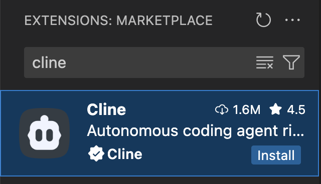
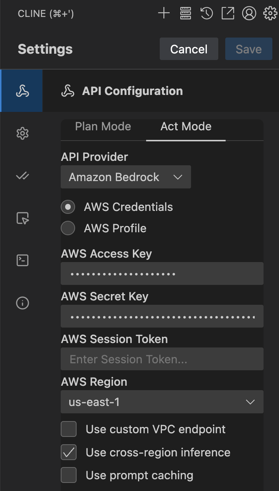
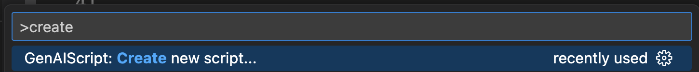

---

import BlogNarration from "../../../components/BlogNarration.astro";

<BlogNarration />

## Introduction

GenAIScript makes it easy to get started coding LLM workflows. However, it can be challenging to use it effectively to write complex workflows because advanced techniques and performance optimizations can be out of the reach of many developers. In this post, we will explore how coding assistants can help us write advanced GenAIScript workflows faster and with less effort.

## The Task

Documenting existing code is a common task in software development. It can be time-consuming and often ignored. However, it is essential for maintaining code quality and ensuring that the code is understandable by other developers.

Our goal today is to write a GenAIScript workflow that automatically adds JSDoc comments to TypeScript code that does not already have them.

The script will use AST grep functions to search the code, and then use a large language model to generate JSDoc comments for the code, and modify the code to add the comments in place.

AST grep is an advanced feature of GenAIScript that allows us to search for specific patterns in the code's abstract syntax tree (AST). It's much more effective than using LLMs to analyze the code, as it allows us to quickly find code segments that match specific criteria.

Peli explored this feature in his [AST Grep and Transform](https://microsoft.github.io/genaiscript/blog/ast-grep-and-transform/) post, and we will build on that to create our script.

Here is an example of what we want to achieve:

```ts wrap
// Before
function calculateTotal(price: number, tax: number): number {
  return price + price * tax;
}

// After
/**
 * Calculates the total amount including tax
 * @param {number} price - The base price
 * @param {number} tax - The tax rate as a decimal
 * @returns {number} The total amount including tax
 */
function calculateTotal(price: number, tax: number): number {
  return price + price * tax;
}
```

## Why GenAIScript and not the coding agent?

There are several reasons why GenAIScript is a better choice than using coding assistants in agentic mode to perform the same tasks.

**Speed**: GenAIScript workflows can be executed in parallel, which can significantly reduce the time it takes to complete tasks. Imagine waiting for a coding assistant to finish generating code for a large project in your editor, versus running a GenAIScript workflow that can execute multiple tasks in the background. Which one would you prefer?

**Cost-efficiency**: GenAIScript gives you low-level control over your prompts, which allows you to optimize the prompts for your specific use case. This means you can reduce the number of tokens used, which can help you save money on LLM usage.

**Shareability**: You can share your GenAIScript workflows with other developers on your team. You might be thinking, "But I can share my coding assistant prompts too!" However, GenAIScript workflows are more than just prompts; they are self-contained scripts that chains multiple LLM calls together to perform a specific task. This makes them more powerful and flexible than a single prompt.

## Setup

We will use Cline to write our GenAIScript code. But you can use any coding assistant, including Github Copilot, Cursor or Windsurf.

First, let's install Cline from the VS Code Marketplace.



Next, we will configure Cline with our credentials. If you use Bedrock, like me, you will need to set the `AWS_ACCESS_KEY_ID` and `AWS_SECRET_ACCESS_KEY` environment variables in your terminal.



Now we are ready to write our GenAIScript code. We will open our project and set it up for GenAIScript development. This involves creating a new script file. I always create one called poem.



Finally, we will write a prompt for Cline to generate the GenAIScript code. The prompt will describe the task we want to accomplish, and Cline will generate the code for us.

## The Prompt

The following is the prompt I wrote for Cline to generate the GenAIScript code. It is designed to be clear and concise, while also providing enough detail for Cline to understand the task.

```md wrap
You are an expert software engineer, familiar in all aspects of TypeScript and GenAIScript. You will find the documentation for GenAIScript at https://microsoft.github.io/genaiscript/llms.txt. Make sure to follow the links in all the Documentation Sets to understand the full capabilities of GenAIScript before writing the script.

## Task

Your task is to write a GenAIScript script called that searches for the code in a path specified by the user using the AST grep functions, looking for functions, classes, and methods that do not have JSDoc comments. Use AST grep search functionality to perform the search.

For each function, class, or method found, the script invokes a large language model call to generate JSDoc comments that explain the code, with examples of how to use it.

The script then takes the output of this call and modifies the code to add the JSDoc comments in place, prepending the comments above the source code.

## Guidelines

The source code is written in TypeScript ESM for node.js v20+.

## Output Format

- Output a single GenAIScript script file. The file name should be `jsdoc-commentator.genai.mts`.
```

## Analysis of the Prompt

The prompt uses several techniques to ensure that the generated script meets our requirements:

1. **Expertise**: The prompt specifies that the assistant should be an expert in TypeScript and GenAIScript, which ensures that the generated code will be of high quality.
2. **Documentation**: The prompt provides a link to the GenAIScript documentation, which allows the assistant to understand the full capabilities of GenAIScript and use them effectively.
3. **Task Definition**: The prompt clearly defines the task, including the specific requirements for searching for code without JSDoc comments and generating comments using a large language model.
4. **Guidelines**: The prompt specifies that the source code is written in TypeScript ESM for node.js v20+, which ensures that the generated code will be compatible with our project.
5. **Output Format**: The prompt specifies the output format, including the file name and the expected structure of the script.

## Results

After writing the prompt, we use Cline to generate the GenAIScript code. Cline will analyze the prompt and generate a script that meets our requirements.

This is the script Cline generated for me (your script may vary slightly):

```ts wrap
script({
  title: "Add JSDoc Comments to TypeScript Code",
  description:
    "Automatically generates JSDoc comments for TypeScript functions, classes, methods, and interfaces that are missing documentation",
  model: "large",
  parameters: {
    glob: {
      type: "string",
      description:
        "Glob pattern for TypeScript files to process",
      default: "**/*.{ts,tsx}",
    },
    updateExisting: {
      type: "boolean",
      description: "Update existing JSDoc comments",
      default: false,
    },
    applyEdits: {
      type: "boolean",
      description: "Apply the edits automatically",
      default: false,
    },
  },
});

// Find TypeScript files to process
const files = await workspace.findFiles(
  env.vars.glob || "**/*.{ts,tsx}",
  {
    ignore: ["**/node_modules/**", "**/dist/**", "**/*.d.ts"],
  },
);

if (files.length === 0) {
  env.output.log(
    `No TypeScript files found matching pattern: ${env.vars.glob || "**/*.{ts,tsx}"}`,
  );
  cancel("No files to process");
}

env.output.log(
  `Found ${files.length} TypeScript files to analyze for missing JSDoc comments.`,
);

// Define ast-grep patterns to find declarations without JSDoc
const astPatterns = [
  // Function declarations
  {
    name: "function_declaration",
    pattern: {
      rule: {
        kind: "export_statement",
        has: {
          kind: "function_declaration",
          has: {
            kind: "identifier",
            field: "name",
          },
        },
        not: {
          follows: {
            kind: "comment",
            stopBy: "neighbor",
          },
        },
      } satisfies SgRule,
    },
    description: "function declaration",
  },
  // Interface declarations
  {
    name: "interface_declaration",
    pattern: {
      rule: {
        kind: "export_statement",
        has: {
          kind: "interface_declaration",
          has: {
            kind: "type_identifier",
            field: "name",
          },
        },
        not: {
          follows: {
            kind: "comment",
            stopBy: "neighbor",
          },
        },
      } satisfies SgRule,
    },
    description: "interface declaration",
  },
  // Method definitions in classes
  {
    name: "method_definition",
    pattern: {
      rule: {
        kind: "method_definition",
        not: {
          follows: {
            kind: "comment",
            stopBy: "neighbor",
          },
        },
      } satisfies SgRule,
    },
    description: "method declaration",
  },
  // Arrow functions assigned to variables
  {
    name: "arrow_function",
    pattern: {
      rule: {
        kind: "export_statement",
        has: {
          kind: "lexical_declaration",
          has: {
            kind: "variable_declarator",
            has: {
              kind: "arrow_function",
              field: "value",
            },
          },
        },
        not: {
          follows: {
            kind: "comment",
            stopBy: "neighbor",
          },
        },
      } satisfies SgRule,
    },
    description: "arrow function",
  },
  // Type aliases
  {
    name: "type_alias",
    pattern: {
      rule: {
        kind: "export_statement",
        has: {
          kind: "type_alias_declaration",
          has: {
            kind: "type_identifier",
            field: "name",
          },
        },
        not: {
          follows: {
            kind: "comment",
            stopBy: "neighbor",
          },
        },
      } satisfies SgRule,
    },
    description: "type alias declaration",
  },
];

type Target = {
  match: SgNode; // The original match object for reference
};
const allTargets: Target[] = [];

// Get ast-grep instance
const sg = await host.astGrep();

// Process each file using ast-grep
for (const file of files) {
  // Check each ast-grep pattern
  for (const astPattern of astPatterns) {
    try {
      const targets: Target[] = [];
      // Use ast-grep to find matches
      const { matches } = await sg.search(
        "ts",
        file.filename,
        astPattern.pattern,
      );
      const edits = sg.changeset();

      for (const match of matches) {
        targets.push({
          match: match,
        });
      }

      await processTargets(edits, targets);
    } catch (error) {
      console.error(
        `Error processing pattern ${astPattern.name}:`,
        error,
      );
      // Continue with next pattern
    }
  }
}

if (allTargets.length === 0) {
  env.output.log(
    "✅ All TypeScript declarations already have JSDoc comments or no declarations found.",
  );
  cancel("No work needed");
}

env.output.log(
  `Found ${allTargets.length} TypeScript declarations missing JSDoc comments.`,
);

if (!env.vars.applyEdits) {
  env.output.heading(2, "Preview Mode");
  env.output.log(
    "Set `applyEdits: true` to automatically apply the generated JSDoc comments to your source files.",
  );
}

async function processTargets(
  edits: SgChangeSet,
  targets: Target[],
) {
  allTargets.push(...targets);
  // Generate JSDoc for each target using inline prompts
  for (const target of targets) {
    const codeText = target.match.text();

    // Generate JSDoc comment for this specific declaration
    const jsdocComment = await runPrompt(
      (ctx) => {
        ctx.def("CODE", codeText);
        ctx.$`Generate a JSDoc comment for <CODE>. 

Requirements:
- Use proper JSDoc syntax with /** */
- Include appropriate tags (@param, @returns, @throws, etc.)
- Write clear, concise descriptions
- Return ONLY the JSDoc comment block, no other text or code`;
      },
      { model: "large", temperature: 0.1 },
    );

    // Extract the JSDoc comment from the response
    const jsdoc =
      parsers.unfence(jsdocComment.text, "typescript") ||
      jsdocComment.text;

    // Prepend the JSDoc comment to the code
    const newCode = jsdoc + "\n" + codeText;

    if (env.vars.applyEdits) {
      // Apply the edit to add JSDoc comment using changeset
      edits.replace(target.match, newCode);
    } else {
      // Preview mode - show what would be generated
      env.output.heading(4, "JSDoc Comment with Code");
      env.output.fence(newCode, "typescript");
    }
  }

  const modifiedFiles = edits.commit();
  await workspace.writeFiles(modifiedFiles);
}

if (env.vars.applyEdits) {
  env.output.log(
    `✅ Successfully added JSDoc comments to ${allTargets.length} TypeScript declarations.`,
  );
} else {
  env.output.log(
    `📋 Preview complete. Found ${allTargets.length} declarations that need JSDoc comments.`,
  );
  env.output.log(
    "To apply these changes, run the script with `applyEdits: true`.",
  );
}
```

## Running the Script

To run the script, we need to execute it in our terminal. Make sure you have GenAIScript installed and configured correctly.

```sh wrap
npx genaiscript run jsdoc-commentator.genai.mts
```

## Conclusion

In this post, we explored how coding assistants can help us write GenAIScript workflows faster and with less effort. We used Cline to generate a script that automatically adds JSDoc comments to TypeScript code that does not already have them. We also discussed the advantages of using GenAIScript over coding assistants in agentic mode for this task.
