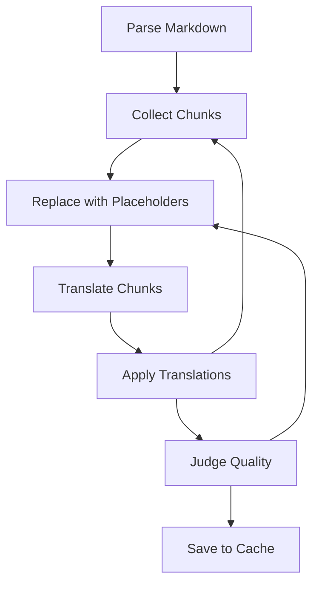

You may have noticed that the GenAIScript documentation is now available in **French** (try the upper-right language dropdown).

The translations are not just a one-time effort; they are **continuously** updated as the documentation evolves, in a GitHub Actions. This means that whenever new content is added or existing content is modified,
the translations are automatically updated to reflect those changes.

In this post, we'll go through some of the interesting parts of the script and how it works.

## The challenge of translating documentation

The goal of this challenge to maintain localized documentation, and automate the process using GenAIScript, GitHub Actions and GitHub Models.
To be successful, we need:

- a model that can produce high quality translations (LLMs like `gpt-4o` and larger have become quite good at it),
- a iterative strategy to partially translate modified chunks in markdown file. We cannot just translate an entire file other the translations will be changing on every round.
- idempotency: if translations are already available, the results should be cached and the script should be a no-op.
- run automatically in a GitHub Action and use GitHub Models for inference.

Let's get going! If you want to read the code, [here is the script](https://github.com/microsoft/genaiscript/blob/dev/packages/sample/genaisrc/mdtranslator.genai.mts).

## Iterative Markdown Translations

Since GenAISCript uses markdown for documentation, we'll focus on this file format exclusively. GenAIScript also uses [Astro Starlight](https://starlight.astro.build/) which adds some well-known metadata in the frontmatter like `title` or `description`.

The core idea behind the translation scripts is the following:

- parse the markdown document into an AST (Abstract Syntax Tree)
- visit the tree and collect all the translatable text chunks (special care for paragraphs)
- replace all translatable chunks with a placeholder a `[T001]bla bla bla...[T002]` and prompt the LLM to translate each chunk
- parse the LLM answer, extract each chunk translation, and visit the tree again applying the translations
- judge the quality of the translation
- save the translations in a cache that they can be reused in a future run



### Markdown AST tools

The web community has been building a large number of tools to parse and manipulate markdown documents.
GenAIScript provides an opinionated plugin, [@genaiscript/plugin-mdast](https://www.npmjs.com/package/@genaiscript/plugin-mdast) that provides the core functionalities without worrying too much about configuration.

- load the plugin

```ts wrap
import { mdast } from "@genaiscript/plugin-mdast";

const { visit, parse, stringify, SKIP } = await mdast();
```

- parse the markdown file

```ts wrap
const root = parse(file);
```

- visit the tree and collect chunks

```ts wrap
const nodes: Record<string, NodeType> = {};
visit(root, ["text", "paragraph"], (node) => {
  const hash = hashNode(node);
  dbg(`node: %s -> %s`, node.type, hash);
  nodes[hash] = node as NodeType;
});
```

- convert the tree back to markdown

```ts wrap
const markdown = stringify(root);
```

With these primitive operations, we are able create a script that can parse, extract translation work, translate, apply translate and stringify back.

### One-shot translations

The approach to the translation is to enclose each translatable chunk in a unique identifier marker like `┌T000┐Continuous Markdown Translations└T000┘`,
then prompt the LLM to translate each chunk and return them in a parsable format.

The prompt looks like this for this article:


`````markdown wrap
<ORIGINAL>
---
title: Continuous Markdown Translations
description: A walkthrough the script that translates the GenAIScript documentation into multiple languages.
date: 2025-07-02
...
---

You may have noticed that the GenAIScript documentation is now available in **French** (try the upper-right language dropdown).

The translations are not just a one-time effort; they are **continuously** updated as the documentation evolves, in a GitHub Actions. This means that whenever new content is added or existing content is modified,
the translations are automatically updated to reflect those changes.

In this post, we'll go through some of the interesting parts of the script and how it works.
...
</ORIGINAL>

<TRANSLATED>
---
title: ┌T000┐Continuous Markdown Translations└T000┘
description: ┌D001┐A walkthrough the script that translates the GenAIScript
  documentation into multiple languages.└D001┘
...
---

┌P002┐You may have noticed that the GenAIScript documentation is now available in **French** (try the upper-right language dropdown).└P002┘

┌P003┐The translations are not just a one-time effort; they are **continuously** updated as the documentation evolves, in a GitHub Actions. This means that whenever new content is added or existing content is modified,
the translations are automatically updated to reflect those changes.└P003┘

┌P004┐In this post, we'll go through some of the interesting parts of the script and how it works.└P004┘
</TRANSLATED>
`````

The LLM is prompted to translate the text between `<ORIGINAL>` and `<TRANSLATED>`, and to return the translated text with the same markers, but with unique identifiers for each translatable chunk.

`````markdown wrap
```T000
Traductions Markdown Continues
```

```D001
Un aperçu du script qui traduit la documentation GenAIScript dans plusieurs langues.
```

```P002
Vous avez peut-être remarqué que la documentation de GenAIScript est désormais disponible en **français** (essayez le menu déroulant de langue en haut à droite).
```

```P003
Les traductions ne sont pas un effort ponctuel ; elles sont mises à jour **en continu** à mesure que la documentation évolue, grâce à GitHub Actions. Cela signifie que chaque fois que du nouveau contenu est ajouté ou que du contenu existant est modifié,
les traductions sont automatiquement mises à jour pour refléter ces changements.
```

```P004
Dans cet article, nous allons passer en revue certains aspects intéressants du script et son fonctionnement.
```

```P005
Le défi de la traduction de la documentation
```
`````

The chunks are parsed and injected back into the AST before rendering to a string. 
We can also store those chunks in a JSON file for caching purposes, so that the next time the script runs, it can reuse the translations without having to re-translate them.

## Judging the translation quality

To ensure the quality of the translations, we implement a few strategies:

- mechanically validate that the resulting markdown is still valid. Something special characters can throw off the parser.
- validate that all external URLs are not modified. The LLM did not modify, add or remove any URLs.
- run a **LLM-as-Judge** prompt that evaluates the translation quality. This is done by prompting the LLM to compare the original and translated text, and provide a quality score.

## Commit and push the changes

Once the translations have passed all the checks, the script commits the changes to the repository and pushes them to the remote branch... and voilà! The translations are now available in the documentation.

## Detailed code walkthrough.

The following is an AI-generated code walkthrough of the script in all its glory.
It's a bit long, but it covers all the interesting parts of the script and how it works.

### Imports

```ts
import { hash } from "crypto";
import { classify } from "@genaiscript/runtime";
import { mdast } from "@genaiscript/plugin-mdast";
import "mdast-util-mdxjs-esm";
import "mdast-util-mdx-jsx";
import type { Node, Text, Heading, Paragraph, PhrasingContent, Yaml } from "mdast";
import { basename, dirname, join, relative } from "path";
import { URL } from "url";
import { xor } from "es-toolkit";
import type { MdxJsxFlowElement } from "mdast-util-mdx-jsx";
```

- `hash` is used to create unique identifiers for document sections.
- `classify` is imported from [@genaiscript/runtime](https://github.com/microsoft/genaiscript/blob/main/packages/cli/src/runtime.ts) to judge translation quality.
- `mdast` parses and builds Markdown Abstract Syntax Trees (ASTs).
- The `"mdast-util-mdxjs-esm"` and `"mdast-util-mdx-jsx"` modules add support for MDX features.
- Types from `"mdast"` help define the structure of Markdown nodes.
- Path and URL helpers organize file handling and patch URLs.
- `xor` compares arrays to find differences.
- `MdxJsxFlowElement` defines MDX JSX block nodes.

### Script configuration

```ts
script({
  accept: ".md,.mdx",
  files: "src/rag/markdown.md",
  parameters: {
    to: {
      type: "string",
      default: "fr",
      description: "The iso-code target language for translation.",
    },
    force: {
      type: "boolean",
      default: false,
      description: "Force translation even if the file has already been translated.",
    },
  },
});
```

- Sets which file types and paths to process (`.md`, `.mdx`).
- Defines parameters: `to` (target language, default French), `force` (retranslate even if already translated).

### Constants and helpers

```ts
const HASH_LENGTH = 20;
const maxPromptPerFile = 5;
const nodeTypes = ["text", "paragraph", "heading", "yaml"];
const starlightDir = "docs/src/content/docs";
const starlightBase = "genaiscript";
const startlightBaseRx = new RegExp(`^/${starlightBase}/`);
const MARKER_START = "┌";
const MARKER_END = "└";
type NodeType = Text | Paragraph | Heading | Yaml;
const langs = {
  fr: "French",
};
```

- Defines how many characters for hashes, max translation attempts, which Markdown nodes to translate, paths, and translation language codes.

```ts
const isUri = (str: string): URL => {
  try {
    return new URL(str);
  } catch {
    return undefined;
  }
};
```

- Checks if a string is a valid URL.

```ts
const hasMarker = (str: string): boolean => {
  return str.includes(MARKER_START) || str.includes(MARKER_END);
};
```

- Checks if a string contains translation markers.

### Main script logic

```ts
export default async function main() {
```
- The script entry point.

```ts
  const { dbg, output, vars } = env;
  const dbgc = host.logger(`script:md`);
  const dbgt = host.logger(`script:tree`);
  const dbge = host.logger(`script:text`);
  const dbgm = host.logger(`script:mdx`);
  const { force } = vars as {
    to: string;
    force: boolean;
  };
```
- Prepares logging, debugging, and grabs user parameters.

```ts
  const tos = vars.to
    .split(",")
    .map((s) => s.trim())
    .filter(Boolean);
  dbg(`tos: %o`, tos);
```
- Supports translating to multiple languages.

```ts
  const ignorer = await parsers.ignore(".mdtranslatorignore");
  const files = env.files
    .filter((f) => ignorer([f]).length)
    .filter(({ filename }) => !tos.some((to) => filename.includes(`/${to.toLowerCase()}/`)));
  if (!files.length) cancel("No files selected.");
  dbg(
    `files: %O`,
    files.map((f) => f.filename),
  );
```
- Ignores files using a local ignore file and excludes already translated files.

```ts
  const { visit, parse, stringify, SKIP } = await mdast();
```
- Loads Markdown parsing and tree traversal functions.

```ts
  const hashNode = (node: Node | string) => {
    if (typeof node === "object") {
      node = structuredClone(node);
      visit(node, (node) => delete node.position);
    }
    const chunkHash = hash("sha-256", JSON.stringify(node));
    return chunkHash.slice(0, HASH_LENGTH).toUpperCase();
  };
```
- Hashes nodes (removing position info) to create unique identifiers for each piece of content.

```ts
  for (const to of tos) {
    let lang = langs[to];
    if (!lang) {
      const res = await prompt`Respond human friendly name of language: ${to}`.options({
        cache: true,
        systemSafety: false,
        responseType: "text",
        throwOnError: true,
      });
      lang = res.text;
    }
```
- Looks up the language name, or asks the AI if it's not in the dictionary.

```ts
    output.heading(2, `Translating Markdown files to ${lang} (${to})`);
    const translationCacheFilename = `docs/translations/${to.toLowerCase()}.json`;
    dbg(`cache: %s`, translationCacheFilename);
    output.itemValue("cache", translationCacheFilename);
    // hash -> text translation
    const translationCache: Record<string, string> = force
      ? {}
      : (await workspace.readJSON(translationCacheFilename)) || {};
    for (const [k, v] of Object.entries(translationCache)) {
      if (hasMarker(v)) delete translationCache[k];
    }
    dbgc(`translation cache: %O`, translationCache);
```
- Loads a cache of previous translations so work is not redone. Removes any placeholder translations.

```ts
    for (const file of files) {
      const { filename } = file;
      output.heading(3, `${filename}`);

      try {
        const starlight = filename.startsWith(starlightDir);
        const translationFn = starlight
          ? filename.replace(starlightDir, join(starlightDir, to.toLowerCase()))
          : path.changeext(filename, `.${to.toLowerCase()}.md`);
        dbg(`translation %s`, translationFn);
```
- Determines the output file path for the translation.

```ts
        const patchFn = (fn: string, trailingSlash?: boolean) => {
          if (typeof fn === "string" && /^\./.test(fn) && starlight) {
            const originalDir = dirname(filename);
            const translationDir = dirname(translationFn);
            const relativeToOriginal = relative(translationDir, originalDir);
            let r = join(relativeToOriginal, fn);
            if (trailingSlash && !r.endsWith("/")) r += "/";
            dbg(`patching %s -> %s`, fn, r);
            return r;
          }
          return fn;
        };
```
- Adjusts image and local import paths so translated files keep working.

```ts
        let content = file.content;
        dbgc(`md: %s`, content);

        // normalize content
        dbgc(`normalizing content`);
        content = stringify(parse(content));
```
- Reads file contents and normalizes formatting before processing.

```ts
        // parse to tree
        dbgc(`parsing %s`, filename);
        const root = parse(content);
        dbgt(`original %O`, root.children);
        // collect original nodes nodes
        const nodes: Record<string, NodeType> = {};
        visit(root, nodeTypes, (node) => {
          const hash = hashNode(node);
          dbg(`node: %s -> %s`, node.type, hash);
          nodes[hash] = node as NodeType;
        });

        dbg(`nodes: %d`, Object.keys(nodes).length);

        const llmHashes: Record<string, string> = {};
        const llmHashTodos = new Set<string>();
```
- Parses content into a Markdown AST and collects unique nodes to translate.

```ts
        // apply translations and mark untranslated nodes with id
        let translated = structuredClone(root);
        visit(translated, nodeTypes, (node) => {
          const nhash = hashNode(node);
          const translation = translationCache[nhash];
          if (translation) {
            dbg(`translated: %s`, nhash);
            Object.assign(node, translation);
          } else {
            // mark untranslated nodes with a unique identifier
            if (node.type === "text") {
              if (!/\s*[.,:;<>\]\[{}\(\)…]+\s*/.test(node.value) && !isUri(node.value)) {
                dbg(`text node: %s`, nhash);
                // compress long hash into LLM friendly short hash
                const llmHash = `T${Object.keys(llmHashes).length.toString().padStart(3, "0")}`;
                llmHashes[llmHash] = nhash;
                llmHashTodos.add(llmHash);
                node.value = `┌${llmHash}┐${node.value}└${llmHash}┘`;
              }
            } else if (node.type === "paragraph" || node.type === "heading") {
              dbg(`paragraph/heading node: %s`, nhash);
              const llmHash = `P${Object.keys(llmHashes).length.toString().padStart(3, "0")}`;
              llmHashes[llmHash] = nhash;
              llmHashTodos.add(llmHash);
              node.children.unshift({
                type: "text",
                value: `┌${llmHash}┐`,
              } as Text);
              node.children.push({
                type: "text",
                value: `└${llmHash}┘`,
              });
              return SKIP; // don't process children of paragraphs
            } else if (node.type === "yaml") {
              dbg(`yaml node: %s`, nhash);
              const data = parsers.YAML(node.value);
              if (data) {
                if (starlight) {
                  if (Array.isArray(data?.hero?.actions)) {
                    data.hero.actions.forEach((action) => {
                      if (typeof action.text === "string") {
                        const nhash = hashNode(action.text);
                        const tr = translationCache[nhash];
                        dbg(`yaml hero.action: %s -> %s`, nhash, tr);
                        if (!tr) action.text = tr;
                        else {
                          const llmHash = `T${Object.keys(llmHashes).length.toString().padStart(3, "0")}`;
                          llmHashes[llmHash] = nhash;
                          llmHashTodos.add(llmHash);
                          action.text = `┌${llmHash}┐${action.text}└${llmHash}┘`;
                        }
                      }
                    });
                  }
                  if (data?.cover?.image) {
                    data.cover.image = patchFn(data.cover.image);
                    dbg(`yaml cover image: %s`, data.cover.image);
                  }
                }
                if (typeof data.excerpt === "string") {
                  const nhash = hashNode(data.excerpt);
                  const tr = translationCache[nhash];
                  if (tr) data.excerpt = tr;
                  else {
                    const llmHash = `T${Object.keys(llmHashes).length.toString().padStart(3, "0")}`;
                    llmHashes[llmHash] = nhash;
                    llmHashTodos.add(llmHash);
                    data.excerpt = `┌${llmHash}┐${data.excerpt}└${llmHash}┘`;
                  }
                }
                if (typeof data.title === "string") {
                  const nhash = hashNode(data.title);
                  const tr = translationCache[nhash];
                  if (tr) data.title = tr;
                  else {
                    const llmHash = `T${Object.keys(llmHashes).length.toString().padStart(3, "0")}`;
                    llmHashes[llmHash] = nhash;
                    llmHashTodos.add(llmHash);
                    data.title = `┌${llmHash}┐${data.title}└${llmHash}┘`;
                  }
                }
                if (typeof data.description === "string") {
                  const nhash = hashNode(data.description);
                  const tr = translationCache[nhash];
                  if (tr) data.title = tr;
                  else {
                    const llmHash = `D${Object.keys(llmHashes).length.toString().padStart(3, "0")}`;
                    llmHashes[llmHash] = nhash;
                    llmHashTodos.add(llmHash);
                    data.description = `┌${llmHash}┐${data.description}└${llmHash}┘`;
                  }
                }
                node.value = YAML.stringify(data);
                return SKIP;
              }
            } else {
              dbg(`untranslated node type: %s`, node.type);
            }
          }
        });
```
- For each node, applies cached translation or marks it with a unique code (e.g. `┌T001┐ ... └T001┘`) for AI to translate.

```ts
        // patch images and esm imports
        visit(translated, ["mdxJsxFlowElement"], (node) => {
          const flow = node as MdxJsxFlowElement;
          for (const attribute of flow.attributes || []) {
            if (attribute.type === "mdxJsxAttribute" && attribute.name === "title") {
              // collect title attributes
              dbgm(`attribute title: %s`, attribute.value);
              let title = attribute.value;
              const nhash = hashNode(title);
              const tr = translationCache[nhash];
              if (tr) title = tr;
              else {
                const llmHash = `T${Object.keys(llmHashes).length.toString().padStart(3, "0")}`;
                llmHashes[llmHash] = nhash;
                llmHashTodos.add(llmHash);
                title = `┌${llmHash}┐${title}└${llmHash}┘`;
              }
              attribute.value = title;
              return SKIP;
            }
          }
        });
```
- Ensures MDX JSX title attributes are handled for translation.

```ts
        dbgt(`translated %O`, translated.children);
        let attempts = 0;
        let lastLLmHashTodos = llmHashTodos.size + 1;
        while (
          llmHashTodos.size &&
          llmHashTodos.size < lastLLmHashTodos &&
          attempts < maxPromptPerFile
        ) {
          attempts++;
          output.itemValue(`missing translations`, llmHashTodos.size);
          dbge(`todos: %o`, Array.from(llmHashTodos));
          const contentMix = stringify(translated);
          dbgc(`translatable content: %s`, contentMix);
```
- Tracks translation attempts and missing nodes to avoid infinite loops.

#### translation prompt

```ts
          const { fences, error } = await runPrompt(
            async (ctx) => {
              const originalRef = ctx.def("ORIGINAL", file.content, { lineNumbers: false });
              const translatedRef = ctx.def("TRANSLATED", contentMix, { lineNumbers: false });
              ctx.$`You are an expert at translating technical documentation into ${lang} (${to}).

      ## Task
      Your task is to translate a Markdown (GFM) document to ${lang} (${to}) while preserving the structure and formatting of the original document.
      You will receive the original document as a variable named ${originalRef} and the currently translated document as a variable named ${translatedRef}.

      Each Markdown AST node in the translated document that has not been translated yet will be enclosed with a unique identifier in the form 
      of \`┌node_identifier┐\` at the start and \`└node_identifier┘\` at the end of the node.
      You should translate the content of each these nodes individually.
      Example:

      \`\`\`markdown
      ┌T001┐
      This is the content to be translated.
      └T001┘

      This is some other content that does not need translation.

      ┌T002┐
      This is another piece of content to be translated.
      └T002┘
      \`\`\`

      ## Output format

      Respond using code regions where the language string is the HASH value
      For example:
      
      \`\`\`T001
      translated content of text enclosed in T001 here (only T001 content!)
      \`\`\`

      \`\`\`T002
      translated content of text enclosed in T002 here (only T002 content!)
      \`\`\`

      \`\`\`T003
      translated content of text enclosed in T003 here (only T003 content!)
      \`\`\`
      ...

      ## Instructions

      - Be extremely careful about the HASH names. They are unique identifiers for each node and should not be changed.
      - Always use code regions to respond with the translated content. 
      - Do not translate the text outside of the HASH tags.
      - Do not change the structure of the document.
      - As much as possible, maintain the original formatting and structure of the document.
      - Do not translate inline code blocks, code blocks, or any other code-related content.
      - Use ' instead of ’
      - Always make sure that the URLs are not modified by the translation.
      - Translate each node individually, preserving the original meaning and context.
      - If you are unsure about the translation, skip the translation.

      `.role("system");
            },
            {
              responseType: "text",
              systemSafety: false,
              system: [],
              cache: true,
              label: `translating ${filename} (${llmHashTodos.size} nodes)`,
            },
          );
```

- Asks the AI to translate only inside the special hash markers, and reply in code blocks with the hash as the language.

```ts
          if (error) {
            output.error(`Error translating ${filename}: ${error.message}`);
            break;
          }

          // collect translations
          for (const fence of fences) {
            const llmHash = fence.language;
            if (llmHashTodos.has(llmHash)) {
              llmHashTodos.delete(llmHash);
              const hash = llmHashes[llmHash];
              dbg(`translation: %s - %s`, llmHash, hash);
              let chunkTranslated = fence.content.replace(/\r?\n$/, "").trim();
              const node = nodes[hash];
              dbg(`original node: %O`, node);
              if (node?.type === "text" && /\s$/.test(node.value)) {
                dbg(`patch trailing space for %s`, hash);
                chunkTranslated += " ";
              }
              chunkTranslated = chunkTranslated
                .replace(/┌[A-Z]\d{3,5}┐/g, "")
                .replace(/└[A-Z]\d{3,5}┘/g, "");
              dbg(`content: %s`, chunkTranslated);
              translationCache[hash] = chunkTranslated;
            }
          }

          lastLLmHashTodos = llmHashTodos.size;
        }
```
- Updates the translation cache with AI responses, strips hash markers, and continues if there are missing translations.

```ts
        // apply translations
        translated = structuredClone(root);

        // apply translations
        visit(translated, nodeTypes, (node) => {
          if (node.type === "yaml") {
            const data = parsers.YAML(node.value);
            if (data) {
              if (starlight) {
                if (data?.hero?.image?.file) {
                  data.hero.image.file = patchFn(data.hero.image.file);
                  dbg(`yaml hero image: %s`, data.hero.image.file);
                }
                if (Array.isArray(data?.hero?.actions)) {
                  data.hero.actions.forEach((action) => {
                    if (typeof action.link === "string") {
                      action.link = action.link.replace(
                        startlightBaseRx,
                        `/${starlightBase}/${to.toLowerCase()}/`,
                      );
                      dbg(`yaml hero action link: %s`, action.link);
                    }
                    if (typeof action.text === "string") {
                      const nhash = hashNode(action.text);
                      const tr = translationCache[nhash];
                      dbg(`yaml hero.action: %s -> %s`, nhash, tr);
                      if (tr) action.text = tr;
                    }
                    if (action?.image?.file) {
                      action.image.file = patchFn(action.image.file);
                      dbg(`yaml hero action image: %s`, action.image.file);
                    }
                  });
                }
                if (data?.cover?.image) {
                  data.cover.image = patchFn(data.cover.image);
                  dbg(`yaml cover image: %s`, data.cover.image);
                }
              }
              if (typeof data.excerpt === "string") {
                const nhash = hashNode(data.excerpt);
                const tr = translationCache[nhash];
                dbg(`yaml excerpt: %s -> %s`, nhash, tr);
                if (tr) data.excerpt = tr;
              }
              if (typeof data.title === "string") {
                const nhash = hashNode(data.title);
                const tr = translationCache[nhash];
                dbg(`yaml title: %s -> %s`, nhash, tr);
                if (tr) data.title = tr;
              }
              if (typeof data.description === "string") {
                const nhash = hashNode(data.description);
                const tr = translationCache[nhash];
                dbg(`yaml description: %s -> %s`, nhash, tr);
                if (tr) data.description = tr;
              }
              node.value = YAML.stringify(data);
              return SKIP;
            }
          } else {
            const hash = hashNode(node);
            const translation = translationCache[hash];
            if (translation) {
              if (node.type === "text") {
                dbg(`translated text: %s -> %s`, hash, translation);
                node.value = translation;
              } else if (node.type === "paragraph" || node.type === "heading") {
                dbg(`translated %s: %s -> %s`, node.type, hash, translation);
                try {
                  const newNodes = parse(translation).children as PhrasingContent[];
                  node.children.splice(0, node.children.length, ...newNodes);
                  return SKIP;
                } catch (error) {
                  output.error(`error parsing paragraph translation`, error);
                  output.fence(node, "json");
                  output.fence(translation);
                }
              } else {
                dbg(`untranslated node type: %s`, node.type);
              }
            }
          }
        });
```
- Walks through the AST and replaces content with translations from cache.

```ts
        // patch images and esm imports
        visit(translated, ["mdxjsEsm", "image"], (node) => {
          if (node.type === "image") {
            node.url = patchFn(node.url);
            return SKIP;
          } else if (node.type === "mdxjsEsm") {
            // path local imports
            const rx = /^(import|\})\s*(.*)\s+from\s+(?:\"|')(\.?\.\/.*)(?:\"|');?$/gm;
            node.value = node.value.replace(rx, (m, k, i, p) => {
              const pp = patchFn(p);
              const r = k === "}" ? `} from "${pp}";` : `import ${i} from "${pp}";`;
              dbg(`mdxjsEsm import: %s -> %s`, m, r);
              return r;
            });
            return SKIP;
          }
        });
```
- Fixes image paths and import statements for translated files.

```ts
        visit(translated, ["mdxJsxFlowElement"], (node) => {
          const flow = node as MdxJsxFlowElement;
          for (const attribute of flow.attributes || []) {
            if (attribute.type === "mdxJsxAttribute" && attribute.name === "title") {
              const hash = hashNode(attribute.value);
              const tr = translationCache[hash];
              if (tr) {
                dbg(`translate title: %s -> %s`, hash, tr);
                attribute.value = tr;
              }
            }
          }
        });
```
- Translates the title attributes for MDX JSX nodes.

```ts
        // patch links
        visit(translated, "link", (node) => {
          if (startlightBaseRx.test(node.url)) {
            node.url = patchFn(node.url.replace(startlightBaseRx, "../"), true);
          }
        });
```
- Makes sure internal doc links are updated for the translated folder structure.

```ts
        dbgt(`stringifying %O`, translated.children);
        let contentTranslated = await stringify(translated);
        if (content === contentTranslated) {
          output.warn(`Unable to translate anything, skipping file.`);
          continue;
        }
```
- Converts the AST back into Markdown, and skips files that didn't change.

```ts
        // validate it stills parses as Markdown
        try {
          parse(contentTranslated);
        } catch (error) {
          output.error(`Translated content is not valid Markdown`, error);
          output.diff(content, contentTranslated);
          continue;
        }
```
- Makes sure the output is still valid Markdown.

```ts
        // validate all external links
        // have same domain
        {
          const originalLinks = new Set<string>();
          visit(root, "link", (node) => {
            if (isUri(node.url)) {
              originalLinks.add(node.url);
            }
          });
          const translatedLinks = new Set<string>();
          visit(translated, "link", (node) => {
            if (isUri(node.url)) {
              translatedLinks.add(node.url);
            }
          });
          const diffLinks = xor(Array.from(originalLinks), Array.from(translatedLinks));
          if (diffLinks.length) {
            output.warn(`some links have changed`);
            output.fence(diffLinks, "yaml");
          }
        }
```
- Checks that external links are not changed by the translation.

```ts
        if (attempts) {
          // judge quality is good enough
          const res = await classify(
            (ctx) => {
              ctx.$`You are an expert at judging the quality of translations. 
          Your task is to determine the quality of the translation of a Markdown document from English to ${lang} (${to}).
          The original document is in ${ctx.def("ORIGINAL", content)}, and the translated document is provided in ${ctx.def("TRANSLATED", contentTranslated, { lineNumbers: true })} (line numbers were added).`.role(
                "system",
              );
            },
            {
              ok: `Translation is faithful to the original document and conveys the same meaning.`,
              bad: `Translation is of low quality or has a different meaning from the original.`,
            },
            {
              label: `judge translation ${to} ${basename(filename)}`,
              explanations: true,
              system: ["system.annotations"],
              systemSafety: false,
            },
          );

          output.resultItem(res.label === "ok", `Translation quality: ${res.label}`);
          if (res.label !== "ok") {
            output.fence(res.answer);
            output.diff(content, contentTranslated);
            continue;
          }
        }
```
- Uses `classify` from GenAIScript Runtime to ask the AI if the translation is good enough.

```ts
        // apply translations and save
        dbgc(`translated: %s`, contentTranslated);
        dbg(`writing translation to %s`, translationFn);

        await workspace.writeText(translationFn, contentTranslated);
        await workspace.writeText(
          translationCacheFilename,
          JSON.stringify(translationCache, null, 2),
        );
      } catch (error) {
        output.error(error);
        break;
      }
    }
  }
}
```
- Writes the translated Markdown and updates the cache for next time.
