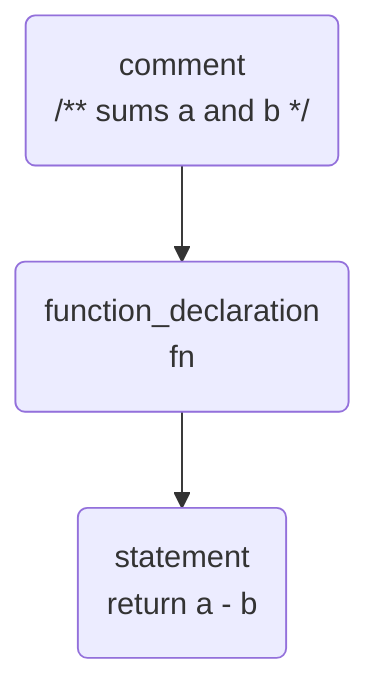
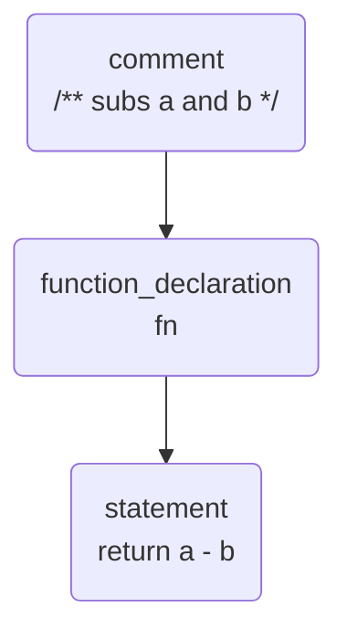

import { Code } from "@astrojs/starlight/components";
import code from "../../../../../../packages/sample/genaisrc/docs.genai.mjs?raw";
import BlogNarration from "../../../../components/BlogNarration.astro";

<BlogNarration />

Page décrivant une stratégie pour construire des scripts GenAI utilisant des arbres de syntaxe abstraite (AST) pour analyser et modifier le code source. Lorsqu’elle est applicable, elle offre une méthode extrêmement flexible et stable pour appliquer des modifications à grande échelle sur le code source. Intéressé ? Allons-y !

## La stratégie de transformation de code basée sur l'AST

L’un des défis lors de la création de scripts GenAI qui mettent à jour le code source consiste à localiser et à mettre à jour correctement ce code. La moindre erreur dans la localisation du code à modifier peut rendre le code cassé. Cela est particulièrement vrai lorsque le code à mettre à jour n’est pas une simple chaîne de caractères, mais une structure complexe comme un objet ou un appel de fonction.

Dans certains cas, vous savez « précisément » quelle partie du code vous souhaitez
mettre à jour. Par exemple, vous souhaitez rafraîchir la documentation d’une fonction après une modification. Vous savez
que la documentation se trouve juste avant la définition de la fonction au moins au sens du langage de programmation,
mais le nombre de lignes vides ou d’espaces peut varier.

```ts title="math.ts"
/** sums a and b */
function fn(a: number, b: number): number {
  return a - b; // oops outdated
}
```

Dans ce genre de scénario, vous pouvez utiliser l’Arbre de Syntaxe Abstraite (AST) pour localiser le code à mettre à jour. L’AST est une représentation arborescente du code.



Ainsi, au lieu de lutter contre les espaces et les sauts de ligne, vous pouvez simplement localiser le nœud `function_declaration` qui suit
un nœud `comment`.

```ts title="docs.genai.mts" wrap
const node = sg.search("functions without comments");
```

Une fois que vous avez localisé le nœud à mettre à jour, vous pouvez faire toutes les transformations que vous souhaitez, par exemple le remplacer par un autre texte. En termes de script GenAI, cela signifie que vous pouvez construire une invite qui inclut autant de contexte que nécessaire, générer une réponse.

```ts title="docs.genai.mts" wrap
$`Update the documentation of the function 'fn' to reflect the new behavior of the function.`;
fence(node.text());
```

```txt
/* subs a and b */
```

Une fois que le LLM répond avec le nouveau commentaire, vous pouvez l’insérer comme contenu du nœud dans l’AST.

```ts title="docs.genai.mts"
edits.replace(node.comment(), response);
```



Voila ! Vous n’avez touché que la partie du fichier que vous vouliez mettre à jour !

```ts title="math.ts"
/** subs a and b */
function fn(a: number, b: number): number {
  return a - b;
}
```

Pour résumer, cette stratégie repose sur les étapes suivantes :

1. **rechercher** Utilisez l’AST pour localiser le nœud à mettre à jour.
2. **transformer et remplacer** Utilisez le LLM pour générer le contenu du nœud.
3. **valider** Mettez à jour le nœud dans l’AST avec le nouveau contenu.

## AST-grep


[ast-grep(sg)](https://ast-grep.github.io/) est un outil rapide et polyglotte pour la recherche structurelle dans le code,
lint, réécriture à grande échelle. **sg** nous fournit les capacités de recherche/remplacement dans l’AST nécessaires pour
implémenter la stratégie ci-dessus.

GenAIScript bénéficie de la parfaite [intégration avec Node.JS](https://ast-grep.github.io/reference/api.html#napi),
qui est disponible via la méthode [`host.astGrep()`](https://microsoft.github.io/genaiscript/reference/scripts/ast-grep).

### ### Recherche

La méthode `sg.search` permet de rechercher des nœuds dans l’AST. Elle prend en paramètre la langue, le motif de fichier,
et la syntaxe du modèle, et retourne une liste de correspondances.

```ts title="docs.genai.mts" wrap
// search
const { matches, replace } = await sg.search("ts", "src/*fib*.ts", {
  rule: {
    kind: "function_declaration",
    not: {
      precedes: {
        kind: "comment",
        stopBy: "neighbor",
      },
    },
  },
});
```

### ### Édition

La méthode `sg.changeset` crée un ensemble de modifications pouvant être appliqué à un ensemble de fichiers.

```ts
// transform
const edits = sg.changeset();
for (const match of matches) {
  const { text } = await prompt`Generate new docs for ${match.text()}`;
  // replace
  edits.replace(match.comment(), text); // it's somewhat more involved
}
// commit all edits to file
await workspace.writeFiles(edits.commit());
```

Exemple : Générateur / Mise à jour de documentation <a id="sample" href="" />Vous trouverez une description complète de la création du script générateur/mise à jour de documentation ci-dessous
dans la [documentation](../../reference/scripts/ast-grep/). Je vous encourage à la lire pour approfondir.Le script `docs` est un générateur/mise à jour de documentation.- utilise ast-grep pour trouver et générer la documentation manquante pour les fonctions TypeScript exportées. Une seconde requête LLM-as-Judge
est utilisée pour vérifier que la documentation générée est correcte.

- si l'option `diff` est sélectionnée, il filtrera les fonctions qui n'intersectent pas avec le
  diff (c'est plutôt naïf mais un bon début...).
- il peut également être utilisé pour mettre à jour la documentation d'une fonction qui a été modifiée.
- il fonctionne quel que soit la taille du fichier ou le nombre de fichiers, car la plupart des transformations sont hyper-localisées.```sh title="générer et rafraîchir ma doc STP"
  genaiscript run docs -- --diff

````
---

Vous trouverez ci-dessous une description complète de la création du script de générateur/mise à jour de documentation dans la [documentation](../../reference/scripts/ast-grep/). Je vous encourage à la lire pour approfondir.

Le script `docs` est un générateur/mise à jour de documentation.

* \*: utilise ast-grep pour trouver et générer la documentation manquante pour une fonction TypeScript exportée. Une seconde
  requête en tant que juge par LLM est utilisée pour vérifier que la documentation générée est correcte.
* \*: si l’option `diff` est sélectionnée, elle filtrera les fonctions qui n’intersectent pas avec la diffférence (ce qui est assez naïf mais un bon début…).
* \*: elle peut également être utilisée pour mettre à jour la documentation d’une fonction modifiée.
* \*: elle fonctionne indépendamment de la taille du fichier ou du nombre de fichiers, car la majorité des transformations sont hyper-localisées.

```sh title="generate and refresh my docs plz"
genaiscript run docs -- --diff
````

Voici quelques exemples d’application des scripts (one-shot, sans modification humaine, édition multiple par fichier) :

- - [Code TypeScript](https://github.com/pelikhan/TypeScript/pull/1), j’ai arrêté le script après un moment, il tournait en douceur.
- - [Code GenAIScript](https://github.com/microsoft/genaiscript/pull/1376/files), cette modification inclut aussi la mise à jour vers GenAIScript lors de la construction de la fonctionnalité.

Voici, c’est parti :

<Code code={code} lang="ts" wrap title="docs.genai.mts" />

- - [source originale](https://github.com/microsoft/genaiscript/blob/main/genaisrc/docs.genai.mts)

<hr />

Traduit par IA. Veuillez vérifier le contenu pour plus de précision.
