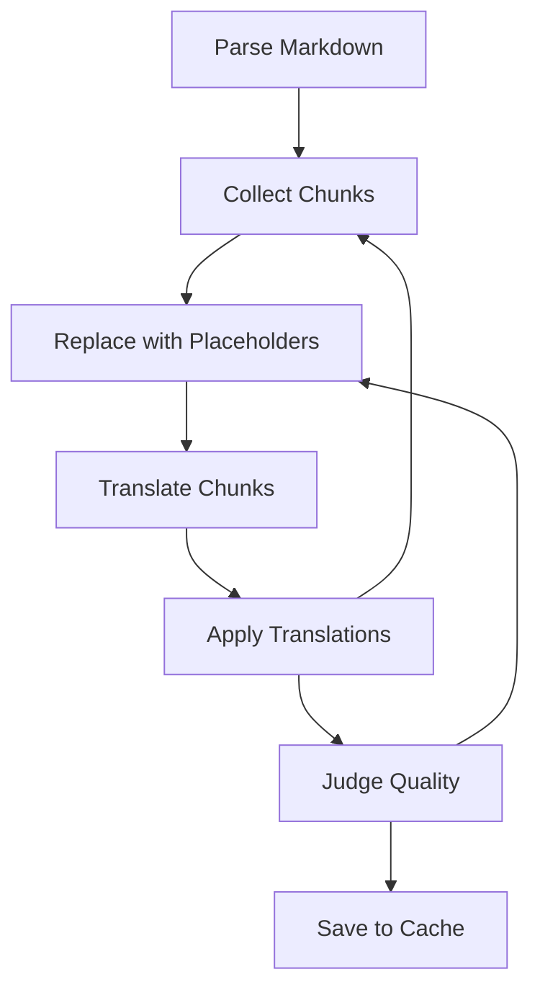

Vous avez peut-être remarqué que la documentation de GenAIScript est désormais disponible en **français** (essayez le menu déroulant de langue en haut à droite).

Les traductions ne sont pas un effort ponctuel ; elles sont mises à jour **en continu** à mesure que la documentation évolue, grâce à GitHub Actions. Cela signifie que chaque fois que du nouveau contenu est ajouté ou que du contenu existant est modifié,
les traductions sont automatiquement mises à jour pour refléter ces changements.

Dans cet article, nous allons passer en revue certains aspects intéressants du script et son fonctionnement.

:::note
The script in this blog is packaged as [custom github action](https://github.com/pelikhan/action-continuous-translation).
:::

## Le défi de la traduction de la documentation

L'objectif de ce défi est de maintenir une documentation localisée, et d'automatiser le processus grâce à GenAIScript, GitHub Actions et GitHub Models.
Pour réussir, nous avons besoin :

* d'un modèle capable de produire des traductions de haute qualité (les LLMs comme `gpt-4o` et supérieurs sont devenus assez efficaces pour cela),
* d'une stratégie itérative pour traduire partiellement les parties modifiées d'un fichier markdown. Nous ne pouvons pas simplement traduire tout un fichier car les traductions changeraient à chaque itération.
* d'idempotence : si les traductions sont déjà disponibles, les résultats doivent être mis en cache et le script ne doit effectuer aucune action.
* d'une exécution automatique via une GitHub Action et de l'utilisation de GitHub Models pour l'inférence.

C'est parti ! Si vous souhaitez consulter le code, [voici le script](https://github.com/microsoft/genaiscript/blob/dev/packages/sample/genaisrc/mdtranslator.genai.mts).

## Traductions Markdown Itératives

Comme GenAIScript utilise le markdown pour la documentation, nous allons nous concentrer exclusivement sur ce format de fichier. GenAIScript utilise aussi [Astro Starlight](https://starlight.astro.build/) qui ajoute des métadonnées bien connues dans le frontmatter comme `title` ou `description`.

L'idée principale derrière les scripts de traduction est la suivante :

* analyser le document markdown en un AST (Abstract Syntax Tree)
* parcourir l'arbre et collecter tous les blocs de texte traduisibles (attention particulière aux paragraphes)
* remplacer tous les blocs traduisibles par un placeholder, par exemple `[T001]bla bla bla...[T002]`, et demander au LLM de traduire chaque bloc
* analyser la réponse du LLM, extraire chaque traduction de bloc, et revisiter l'arbre pour appliquer les traductions
* évaluer la qualité de la traduction
* sauvegarder les traductions dans un cache afin de les réutiliser lors d'une prochaine exécution



### Outils AST pour Markdown

La communauté web a développé de nombreux outils pour analyser et manipuler des documents markdown.
GenAIScript propose un plugin opinioné, [@genaiscript/plugin-mdast](https://www.npmjs.com/package/@genaiscript/plugin-mdast), qui fournit les fonctionnalités principales sans se soucier de la configuration.

* charger le plugin

```ts wrap
import { mdast } from "@genaiscript/plugin-mdast";

const { visit, parse, stringify, SKIP } = await mdast();
```

* analyser le fichier markdown

```ts wrap
const root = parse(file);
```

* parcourir l'arbre et collecter les blocs

```ts wrap
const nodes: Record<string, NodeType> = {};
visit(root, ["text", "paragraph"], (node) => {
  const hash = hashNode(node);
  dbg(`node: %s -> %s`, node.type, hash);
  nodes[hash] = node as NodeType;
});
```

* convertir l'arbre à nouveau en markdown

```ts wrap
const markdown = stringify(root);
```

Avec ces opérations primitives, nous pouvons créer un script capable d'analyser, d'extraire les tâches de traduction, de traduire, d'appliquer la traduction puis de convertir de nouveau en markdown.

### Traductions en une seule passe

La méthode consiste à entourer chaque segment traduisible d'un marqueur d'identifiant unique comme `Continuous Markdown Translations`, puis à demander au LLM de traduire chaque segment et à retourner les traductions dans un format analysable.

Voici à quoi ressemble le prompt pour cet article :

```markdown wrap
<ORIGINAL>
---
title: Continuous Markdown Translations
description: A walkthrough the script that translates the GenAIScript documentation into multiple languages.
date: 2025-07-02
...
---

You may have noticed that the GenAIScript documentation is now available in **French** (try the upper-right language dropdown).

The translations are not just a one-time effort; they are **continuously** updated as the documentation evolves, in a GitHub Actions. This means that whenever new content is added or existing content is modified,
the translations are automatically updated to reflect those changes.

In this post, we'll go through some of the interesting parts of the script and how it works.
...
</ORIGINAL>

<TRANSLATED>
---
title: ┌T000┐Continuous Markdown Translations└T000┘
description: ┌D001┐A walkthrough the script that translates the GenAIScript
  documentation into multiple languages.└D001┘
...
---

┌P002┐You may have noticed that the GenAIScript documentation is now available in **French** (try the upper-right language dropdown).└P002┘

┌P003┐The translations are not just a one-time effort; they are **continuously** updated as the documentation evolves, in a GitHub Actions. This means that whenever new content is added or existing content is modified,
the translations are automatically updated to reflect those changes.└P003┘

┌P004┐In this post, we'll go through some of the interesting parts of the script and how it works.└P004┘
</TRANSLATED>
```

Le LLM doit traduire le texte entre `<ORIGINAL>` et `<TRANSLATED>`, puis renvoyer le texte traduit avec les mêmes balises, chaque segment traduisible ayant un identifiant unique.

````markdown wrap
```T000
Traductions Markdown Continues
```

```D001
Un aperçu du script qui traduit la documentation GenAIScript dans plusieurs langues.
```

```P002
Vous avez peut-être remarqué que la documentation de GenAIScript est désormais disponible en **français** (essayez le menu déroulant de langue en haut à droite).
```

```P003
Les traductions ne sont pas un effort ponctuel ; elles sont mises à jour **en continu** à mesure que la documentation évolue, grâce à GitHub Actions. Cela signifie que chaque fois que du nouveau contenu est ajouté ou que du contenu existant est modifié,
les traductions sont automatiquement mises à jour pour refléter ces changements.
```

```P004
Dans cet article, nous allons passer en revue certains aspects intéressants du script et son fonctionnement.
```

```P005
Le défi de la traduction de la documentation
```
````

Les segments sont alors analysés puis injectés de nouveau dans l'AST avant d'être rendus en chaîne. On peut également les enregistrer dans un fichier JSON pour le cache, afin que lors du prochain passage du script, il puisse réutiliser les traductions sans devoir les refaire.

## Évaluer la qualité de la traduction

Pour garantir la qualité des traductions, nous appliquons plusieurs stratégies :

* valider mécaniquement la validité du Markdown obtenu. Certains caractères spéciaux peuvent bloquer l'analyseur.
* s'assurer qu'aucune URL externe n'a été modifiée. Le LLM ne doit ni modifier, ni ajouter, ni supprimer d'URL.
* lancer un prompt **LLM-as-Judge** qui évalue la qualité de traduction. Cela se fait en demandant au LLM de comparer l'original et la traduction, puis de fournir un score de qualité.

## Commit et push des modifications

Une fois toutes les vérifications passées, le script commite les changements et les pousse sur la branche distante... et voilà ! Les traductions sont désormais accessibles dans la documentation.

## Explication détaillée du code

Ce qui suit est une revue de code générée par l'IA qui couvre tout le script dans le détail. C'est un peu long, mais cela explique tout ce qui est intéressant dans ce script et son fonctionnement.

### Imports

```ts
import { hash } from "crypto";
import { classify } from "@genaiscript/runtime";
import { mdast } from "@genaiscript/plugin-mdast";
import "mdast-util-mdxjs-esm";
import "mdast-util-mdx-jsx";
import type { Node, Text, Heading, Paragraph, PhrasingContent, Yaml } from "mdast";
import { basename, dirname, join, relative } from "path";
import { URL } from "url";
import { xor } from "es-toolkit";
import type { MdxJsxFlowElement } from "mdast-util-mdx-jsx";
```

* `hash` est utilisé pour créer des identifiants uniques pour les sections du document.
* `classify` est importé depuis [@genaiscript/runtime](https://github.com/microsoft/genaiscript/blob/main/packages/cli/src/runtime.ts) pour juger la qualité des traductions.
* `mdast` permet d'analyser et de construire des arbres de syntaxe abstraite Markdown (AST).
* Les modules `"mdast-util-mdxjs-esm"` et `"mdast-util-mdx-jsx"` ajoutent la prise en charge des fonctionnalités MDX.
* Les types venant de `"mdast"` servent à définir la structure des nœuds Markdown.
* Les helpers de chemin et d'URL facilitent la gestion des fichiers et la correction des URLs.
* `xor` permet de comparer des tableaux pour détecter les différences.
* `MdxJsxFlowElement` définit les nœuds de bloc MDX JSX.

### Configuration du script

```ts
script({
  accept: ".md,.mdx",
  files: "src/rag/markdown.md",
  parameters: {
    to: {
      type: "string",
      default: "fr",
      description: "The iso-code target language for translation.",
    },
    force: {
      type: "boolean",
      default: false,
      description: "Force translation even if the file has already been translated.",
    },
  },
});
```

* Définit les extensions de fichiers et les chemins à traiter (`.md`, `.mdx`).
* Définit les paramètres : `to` (langue cible, français par défaut), `force` (retraduit même si déjà traduit).

### Constantes et utilitaires

```ts
const HASH_LENGTH = 20;
const maxPromptPerFile = 5;
const nodeTypes = ["text", "paragraph", "heading", "yaml"];
const starlightDir = "docs/src/content/docs";
const starlightBase = "genaiscript";
const startlightBaseRx = new RegExp(`^/${starlightBase}/`);
const MARKER_START = "┌";
const MARKER_END = "└";
type NodeType = Text | Paragraph | Heading | Yaml;
const langs = {
  fr: "French",
};
```

* Définit la longueur des hash, la limite d'essais de traduction, les types de nœuds Markdown à traduire, les chemins, et les codes de langues disponibles.

```ts
const isUri = (str: string): URL => {
  try {
    return new URL(str);
  } catch {
    return undefined;
  }
};
```

* Vérifie si une chaîne est une URL valide.

```ts
const hasMarker = (str: string): boolean => {
  return str.includes(MARKER_START) || str.includes(MARKER_END);
};
```

* Détecte si une chaîne contient des marqueurs de traduction.

### Logique principale du script

```ts
export default async function main() {
```

* C'est le point d'entrée du script.

```ts
  const { dbg, output, vars } = env;
  const dbgc = host.logger(`script:md`);
  const dbgt = host.logger(`script:tree`);
  const dbge = host.logger(`script:text`);
  const dbgm = host.logger(`script:mdx`);
  const { force } = vars as {
    to: string;
    force: boolean;
  };
```

* Prépare le logging, le debug, et récupère les paramètres utilisateur.

```ts
  const tos = vars.to
    .split(",")
    .map((s) => s.trim())
    .filter(Boolean);
  dbg(`tos: %o`, tos);
```

* Permet la traduction vers plusieurs langues en une passe.

```ts
  const ignorer = await parsers.ignore(".mdtranslatorignore");
  const files = env.files
    .filter((f) => ignorer([f]).length)
    .filter(({ filename }) => !tos.some((to) => filename.includes(`/${to.toLowerCase()}/`)));
  if (!files.length) cancel("No files selected.");
  dbg(
    `files: %O`,
    files.map((f) => f.filename),
  );
```

* Ignore les fichiers listés dans `.mdtranslatorignore` et exclut ceux déjà traduits.

```ts
  const { visit, parse, stringify, SKIP } = await mdast();
```

* Charge les fonctions d'analyse et de parcours Markdown.

```ts
  const hashNode = (node: Node | string) => {
    if (typeof node === "object") {
      node = structuredClone(node);
      visit(node, (node) => delete node.position);
    }
    const chunkHash = hash("sha-256", JSON.stringify(node));
    return chunkHash.slice(0, HASH_LENGTH).toUpperCase();
  };
```

* Crée un hash des nœuds (sans position) pour générer des identifiants uniques à chaque segment de texte.

```ts
  for (const to of tos) {
    let lang = langs[to];
    if (!lang) {
      const res = await prompt`Respond human friendly name of language: ${to}`.options({
        cache: true,
        systemSafety: false,
        responseType: "text",
        throwOnError: true,
      });
      lang = res.text;
    }
```

* Recherche le nom de la langue ou le demande à l'IA si non référencée.

```ts
    output.heading(2, `Translating Markdown files to ${lang} (${to})`);
    const translationCacheFilename = `docs/translations/${to.toLowerCase()}.json`;
    dbg(`cache: %s`, translationCacheFilename);
    output.itemValue("cache", translationCacheFilename);
    // hash -> text translation
    const translationCache: Record<string, string> = force
      ? {}
      : (await workspace.readJSON(translationCacheFilename)) || {};
    for (const [k, v] of Object.entries(translationCache)) {
      if (hasMarker(v)) delete translationCache[k];
    }
    dbgc(`translation cache: %O`, translationCache);
```

* Charge le cache des traductions précédentes pour éviter de retraduire. Supprime tout segment laissé en attente avec un marqueur.

```ts
    for (const file of files) {
      const { filename } = file;
      output.heading(3, `${filename}`);

      try {
        const starlight = filename.startsWith(starlightDir);
        const translationFn = starlight
          ? filename.replace(starlightDir, join(starlightDir, to.toLowerCase()))
          : path.changeext(filename, `.${to.toLowerCase()}.md`);
        dbg(`translation %s`, translationFn);
```

* Détermine le chemin du fichier de sortie pour la traduction.

```ts
        const patchFn = (fn: string, trailingSlash?: boolean) => {
          if (typeof fn === "string" && /^\./.test(fn) && starlight) {
            const originalDir = dirname(filename);
            const translationDir = dirname(translationFn);
            const relativeToOriginal = relative(translationDir, originalDir);
            let r = join(relativeToOriginal, fn);
            if (trailingSlash && !r.endsWith("/")) r += "/";
            dbg(`patching %s -> %s`, fn, r);
            return r;
          }
          return fn;
        };
```

* Corrige les chemins d'images et d'import locaux pour garantir la fonctionnalité dans les fichiers traduits.

```ts
        let content = file.content;
        dbgc(`md: %s`, content);

        // normalize content
        dbgc(`normalizing content`);
        content = stringify(parse(content));
```

* Lit le contenu des fichiers et normalise la mise en forme avant tout traitement.

```ts
        // parse to tree
        dbgc(`parsing %s`, filename);
        const root = parse(content);
        dbgt(`original %O`, root.children);
        // collect original nodes nodes
        const nodes: Record<string, NodeType> = {};
        visit(root, nodeTypes, (node) => {
          const hash = hashNode(node);
          dbg(`node: %s -> %s`, node.type, hash);
          nodes[hash] = node as NodeType;
        });

        dbg(`nodes: %d`, Object.keys(nodes).length);

        const llmHashes: Record<string, string> = {};
        const llmHashTodos = new Set<string>();
```

* Parse le contenu en AST Markdown et collecte les nœuds uniques à traduire.

```ts
        // apply translations and mark untranslated nodes with id
        let translated = structuredClone(root);
        visit(translated, nodeTypes, (node) => {
          const nhash = hashNode(node);
          const translation = translationCache[nhash];
          if (translation) {
            dbg(`translated: %s`, nhash);
            Object.assign(node, translation);
          } else {
            // mark untranslated nodes with a unique identifier
            if (node.type === "text") {
              if (!/\s*[.,:;<>\]\[{}\(\)…]+\s*/.test(node.value) && !isUri(node.value)) {
                dbg(`text node: %s`, nhash);
                // compress long hash into LLM friendly short hash
                const llmHash = `T${Object.keys(llmHashes).length.toString().padStart(3, "0")}`;
                llmHashes[llmHash] = nhash;
                llmHashTodos.add(llmHash);
                node.value = `┌${llmHash}┐${node.value}└${llmHash}┘`;
              }
            } else if (node.type === "paragraph" || node.type === "heading") {
              dbg(`paragraph/heading node: %s`, nhash);
              const llmHash = `P${Object.keys(llmHashes).length.toString().padStart(3, "0")}`;
              llmHashes[llmHash] = nhash;
              llmHashTodos.add(llmHash);
              node.children.unshift({
                type: "text",
                value: `┌${llmHash}┐`,
              } as Text);
              node.children.push({
                type: "text",
                value: `└${llmHash}┘`,
              });
              return SKIP; // don't process children of paragraphs
            } else if (node.type === "yaml") {
              dbg(`yaml node: %s`, nhash);
              const data = parsers.YAML(node.value);
              if (data) {
                if (starlight) {
                  if (Array.isArray(data?.hero?.actions)) {
                    data.hero.actions.forEach((action) => {
                      if (typeof action.text === "string") {
                        const nhash = hashNode(action.text);
                        const tr = translationCache[nhash];
                        dbg(`yaml hero.action: %s -> %s`, nhash, tr);
                        if (!tr) action.text = tr;
                        else {
                          const llmHash = `T${Object.keys(llmHashes).length.toString().padStart(3, "0")}`;
                          llmHashes[llmHash] = nhash;
                          llmHashTodos.add(llmHash);
                          action.text = `┌${llmHash}┐${action.text}└${llmHash}┘`;
                        }
                      }
                    });
                  }
                  if (data?.cover?.image) {
                    data.cover.image = patchFn(data.cover.image);
                    dbg(`yaml cover image: %s`, data.cover.image);
                  }
                }
                if (typeof data.excerpt === "string") {
                  const nhash = hashNode(data.excerpt);
                  const tr = translationCache[nhash];
                  if (tr) data.excerpt = tr;
                  else {
                    const llmHash = `T${Object.keys(llmHashes).length.toString().padStart(3, "0")}`;
                    llmHashes[llmHash] = nhash;
                    llmHashTodos.add(llmHash);
                    data.excerpt = `┌${llmHash}┐${data.excerpt}└${llmHash}┘`;
                  }
                }
                if (typeof data.title === "string") {
                  const nhash = hashNode(data.title);
                  const tr = translationCache[nhash];
                  if (tr) data.title = tr;
                  else {
                    const llmHash = `T${Object.keys(llmHashes).length.toString().padStart(3, "0")}`;
                    llmHashes[llmHash] = nhash;
                    llmHashTodos.add(llmHash);
                    data.title = `┌${llmHash}┐${data.title}└${llmHash}┘`;
                  }
                }
                if (typeof data.description === "string") {
                  const nhash = hashNode(data.description);
                  const tr = translationCache[nhash];
                  if (tr) data.title = tr;
                  else {
                    const llmHash = `D${Object.keys(llmHashes).length.toString().padStart(3, "0")}`;
                    llmHashes[llmHash] = nhash;
                    llmHashTodos.add(llmHash);
                    data.description = `┌${llmHash}┐${data.description}└${llmHash}┘`;
                  }
                }
                node.value = YAML.stringify(data);
                return SKIP;
              }
            } else {
              dbg(`untranslated node type: %s`, node.type);
            }
          }
        });
```

* Pour chaque nœud, applique la traduction du cache ou marque le segment avec un identifiant unique (ex : `...`) pour la traduction IA.

```ts
        // patch images and esm imports
        visit(translated, ["mdxJsxFlowElement"], (node) => {
          const flow = node as MdxJsxFlowElement;
          for (const attribute of flow.attributes || []) {
            if (attribute.type === "mdxJsxAttribute" && attribute.name === "title") {
              // collect title attributes
              dbgm(`attribute title: %s`, attribute.value);
              let title = attribute.value;
              const nhash = hashNode(title);
              const tr = translationCache[nhash];
              if (tr) title = tr;
              else {
                const llmHash = `T${Object.keys(llmHashes).length.toString().padStart(3, "0")}`;
                llmHashes[llmHash] = nhash;
                llmHashTodos.add(llmHash);
                title = `┌${llmHash}┐${title}└${llmHash}┘`;
              }
              attribute.value = title;
              return SKIP;
            }
          }
        });
```

* Assure la prise en compte de l'attribut `title` des composants MDX JSX pour la traduction.

```ts
        dbgt(`translated %O`, translated.children);
        let attempts = 0;
        let lastLLmHashTodos = llmHashTodos.size + 1;
        while (
          llmHashTodos.size &&
          llmHashTodos.size < lastLLmHashTodos &&
          attempts < maxPromptPerFile
        ) {
          attempts++;
          output.itemValue(`missing translations`, llmHashTodos.size);
          dbge(`todos: %o`, Array.from(llmHashTodos));
          const contentMix = stringify(translated);
          dbgc(`translatable content: %s`, contentMix);
```

* Suit les tentatives de traduction et les segments manquants afin d'éviter les boucles infinies.

#### prompt de traduction

```ts
          const { fences, error } = await runPrompt(
            async (ctx) => {
              const originalRef = ctx.def("ORIGINAL", file.content, { lineNumbers: false });
              const translatedRef = ctx.def("TRANSLATED", contentMix, { lineNumbers: false });
              ctx.$`You are an expert at translating technical documentation into ${lang} (${to}).

      ## Task
      Your task is to translate a Markdown (GFM) document to ${lang} (${to}) while preserving the structure and formatting of the original document.
      You will receive the original document as a variable named ${originalRef} and the currently translated document as a variable named ${translatedRef}.

      Each Markdown AST node in the translated document that has not been translated yet will be enclosed with a unique identifier in the form 
      of \`┌node_identifier┐\` at the start and \`└node_identifier┘\` at the end of the node.
      You should translate the content of each these nodes individually.
      Example:

      \`\`\`markdown
      ┌T001┐
      This is the content to be translated.
      └T001┘

      This is some other content that does not need translation.

      ┌T002┐
      This is another piece of content to be translated.
      └T002┘
      \`\`\`

      ## Output format

      Respond using code regions where the language string is the HASH value
      For example:
      
      \`\`\`T001
      translated content of text enclosed in T001 here (only T001 content!)
      \`\`\`

      \`\`\`T002
      translated content of text enclosed in T002 here (only T002 content!)
      \`\`\`

      \`\`\`T003
      translated content of text enclosed in T003 here (only T003 content!)
      \`\`\`
      ...

      ## Instructions

      - Be extremely careful about the HASH names. They are unique identifiers for each node and should not be changed.
      - Always use code regions to respond with the translated content. 
      - Do not translate the text outside of the HASH tags.
      - Do not change the structure of the document.
      - As much as possible, maintain the original formatting and structure of the document.
      - Do not translate inline code blocks, code blocks, or any other code-related content.
      - Use ' instead of ’
      - Always make sure that the URLs are not modified by the translation.
      - Translate each node individually, preserving the original meaning and context.
      - If you are unsure about the translation, skip the translation.

      `.role("system");
            },
            {
              responseType: "text",
              systemSafety: false,
              system: [],
              cache: true,
              label: `translating ${filename} (${llmHashTodos.size} nodes)`,
            },
          );
```

* Demande à l'IA de ne traduire que l'intérieur des balises spéciales et de répondre dans des blocs de code où la langue est le hash concerné.

```ts
          if (error) {
            output.error(`Error translating ${filename}: ${error.message}`);
            break;
          }

          // collect translations
          for (const fence of fences) {
            const llmHash = fence.language;
            if (llmHashTodos.has(llmHash)) {
              llmHashTodos.delete(llmHash);
              const hash = llmHashes[llmHash];
              dbg(`translation: %s - %s`, llmHash, hash);
              let chunkTranslated = fence.content.replace(/\r?\n$/, "").trim();
              const node = nodes[hash];
              dbg(`original node: %O`, node);
              if (node?.type === "text" && /\s$/.test(node.value)) {
                dbg(`patch trailing space for %s`, hash);
                chunkTranslated += " ";
              }
              chunkTranslated = chunkTranslated
                .replace(/┌[A-Z]\d{3,5}┐/g, "")
                .replace(/└[A-Z]\d{3,5}┘/g, "");
              dbg(`content: %s`, chunkTranslated);
              translationCache[hash] = chunkTranslated;
            }
          }

          lastLLmHashTodos = llmHashTodos.size;
        }
```

* Met à jour le cache de traduction avec les réponses de l'IA, retire les marqueurs, et continue si des traductions manquent encore.

```ts
        // apply translations
        translated = structuredClone(root);

        // apply translations
        visit(translated, nodeTypes, (node) => {
          if (node.type === "yaml") {
            const data = parsers.YAML(node.value);
            if (data) {
              if (starlight) {
                if (data?.hero?.image?.file) {
                  data.hero.image.file = patchFn(data.hero.image.file);
                  dbg(`yaml hero image: %s`, data.hero.image.file);
                }
                if (Array.isArray(data?.hero?.actions)) {
                  data.hero.actions.forEach((action) => {
                    if (typeof action.link === "string") {
                      action.link = action.link.replace(
                        startlightBaseRx,
                        `/${starlightBase}/${to.toLowerCase()}/`,
                      );
                      dbg(`yaml hero action link: %s`, action.link);
                    }
                    if (typeof action.text === "string") {
                      const nhash = hashNode(action.text);
                      const tr = translationCache[nhash];
                      dbg(`yaml hero.action: %s -> %s`, nhash, tr);
                      if (tr) action.text = tr;
                    }
                    if (action?.image?.file) {
                      action.image.file = patchFn(action.image.file);
                      dbg(`yaml hero action image: %s`, action.image.file);
                    }
                  });
                }
                if (data?.cover?.image) {
                  data.cover.image = patchFn(data.cover.image);
                  dbg(`yaml cover image: %s`, data.cover.image);
                }
              }
              if (typeof data.excerpt === "string") {
                const nhash = hashNode(data.excerpt);
                const tr = translationCache[nhash];
                dbg(`yaml excerpt: %s -> %s`, nhash, tr);
                if (tr) data.excerpt = tr;
              }
              if (typeof data.title === "string") {
                const nhash = hashNode(data.title);
                const tr = translationCache[nhash];
                dbg(`yaml title: %s -> %s`, nhash, tr);
                if (tr) data.title = tr;
              }
              if (typeof data.description === "string") {
                const nhash = hashNode(data.description);
                const tr = translationCache[nhash];
                dbg(`yaml description: %s -> %s`, nhash, tr);
                if (tr) data.description = tr;
              }
              node.value = YAML.stringify(data);
              return SKIP;
            }
          } else {
            const hash = hashNode(node);
            const translation = translationCache[hash];
            if (translation) {
              if (node.type === "text") {
                dbg(`translated text: %s -> %s`, hash, translation);
                node.value = translation;
              } else if (node.type === "paragraph" || node.type === "heading") {
                dbg(`translated %s: %s -> %s`, node.type, hash, translation);
                try {
                  const newNodes = parse(translation).children as PhrasingContent[];
                  node.children.splice(0, node.children.length, ...newNodes);
                  return SKIP;
                } catch (error) {
                  output.error(`error parsing paragraph translation`, error);
                  output.fence(node, "json");
                  output.fence(translation);
                }
              } else {
                dbg(`untranslated node type: %s`, node.type);
              }
            }
          }
        });
```

* Parcourt l'AST et remplace le contenu par la traduction stockée dans le cache.

```ts
        // patch images and esm imports
        visit(translated, ["mdxjsEsm", "image"], (node) => {
          if (node.type === "image") {
            node.url = patchFn(node.url);
            return SKIP;
          } else if (node.type === "mdxjsEsm") {
            // path local imports
            const rx = /^(import|\})\s*(.*)\s+from\s+(?:\"|')(\.?\.\/.*)(?:\"|');?$/gm;
            node.value = node.value.replace(rx, (m, k, i, p) => {
              const pp = patchFn(p);
              const r = k === "}" ? `} from "${pp}";` : `import ${i} from "${pp}";`;
              dbg(`mdxjsEsm import: %s -> %s`, m, r);
              return r;
            });
            return SKIP;
          }
        });
```

* Corrige les chemins d'images et les imports pour les fichiers traduits.

```ts
        visit(translated, ["mdxJsxFlowElement"], (node) => {
          const flow = node as MdxJsxFlowElement;
          for (const attribute of flow.attributes || []) {
            if (attribute.type === "mdxJsxAttribute" && attribute.name === "title") {
              const hash = hashNode(attribute.value);
              const tr = translationCache[hash];
              if (tr) {
                dbg(`translate title: %s -> %s`, hash, tr);
                attribute.value = tr;
              }
            }
          }
        });
```

* Traduit l'attribut title des composants MDX JSX.

```ts
        // patch links
        visit(translated, "link", (node) => {
          if (startlightBaseRx.test(node.url)) {
            node.url = patchFn(node.url.replace(startlightBaseRx, "../"), true);
          }
        });
```

* Met à jour les liens de documentation internes selon le dossier de traduction.

```ts
        dbgt(`stringifying %O`, translated.children);
        let contentTranslated = await stringify(translated);
        if (content === contentTranslated) {
          output.warn(`Unable to translate anything, skipping file.`);
          continue;
        }
```

* Reconvertit l'AST en Markdown, et saute les fichiers inchangés.

```ts
        // validate it stills parses as Markdown
        try {
          parse(contentTranslated);
        } catch (error) {
          output.error(`Translated content is not valid Markdown`, error);
          output.diff(content, contentTranslated);
          continue;
        }
```

* Valide que la sortie est toujours un Markdown valide.

```ts
        // validate all external links
        // have same domain
        {
          const originalLinks = new Set<string>();
          visit(root, "link", (node) => {
            if (isUri(node.url)) {
              originalLinks.add(node.url);
            }
          });
          const translatedLinks = new Set<string>();
          visit(translated, "link", (node) => {
            if (isUri(node.url)) {
              translatedLinks.add(node.url);
            }
          });
          const diffLinks = xor(Array.from(originalLinks), Array.from(translatedLinks));
          if (diffLinks.length) {
            output.warn(`some links have changed`);
            output.fence(diffLinks, "yaml");
          }
        }
```

* Vérifie que les liens externes n'ont pas été modifiés par la traduction.

```ts
        if (attempts) {
          // judge quality is good enough
          const res = await classify(
            (ctx) => {
              ctx.$`You are an expert at judging the quality of translations. 
          Your task is to determine the quality of the translation of a Markdown document from English to ${lang} (${to}).
          The original document is in ${ctx.def("ORIGINAL", content)}, and the translated document is provided in ${ctx.def("TRANSLATED", contentTranslated, { lineNumbers: true })} (line numbers were added).`.role(
                "system",
              );
            },
            {
              ok: `Translation is faithful to the original document and conveys the same meaning.`,
              bad: `Translation is of low quality or has a different meaning from the original.`,
            },
            {
              label: `judge translation ${to} ${basename(filename)}`,
              explanations: true,
              system: ["system.annotations"],
              systemSafety: false,
            },
          );

          output.resultItem(res.label === "ok", `Translation quality: ${res.label}`);
          if (res.label !== "ok") {
            output.fence(res.answer);
            output.diff(content, contentTranslated);
            continue;
          }
        }
```

* Utilise `classify` de GenAIScript Runtime pour demander à l'IA si la traduction est suffisamment fidèle.

```ts
        // apply translations and save
        dbgc(`translated: %s`, contentTranslated);
        dbg(`writing translation to %s`, translationFn);

        await workspace.writeText(translationFn, contentTranslated);
        await workspace.writeText(
          translationCacheFilename,
          JSON.stringify(translationCache, null, 2),
        );
      } catch (error) {
        output.error(error);
        break;
      }
    }
  }
}
```

* Écrit le Markdown traduit et met à jour le cache pour les prochaines exécutions.
