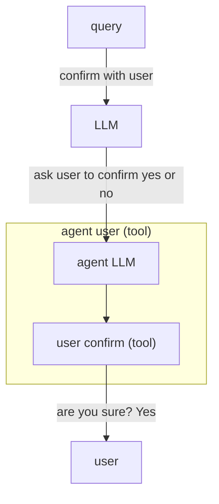

import BlogNarration from "../../../../components/BlogNarration.astro";

<BlogNarration />

GenAIScript définit un [**agent**](../../reference/scripts/agents/) comme un [outil](../../reference/scripts/tools/) qui exécute une [invite intégrée](../../reference/scripts/inline-prompts/) pour accomplir une tâche. L'agent LLM est généralement complété par des outils supplémentaires.



Dans cet article, nous allons apprendre à construire un `agent d'interaction utilisateur` qui permet à l'agent de poser des questions à l'utilisateur.

```js wrap
script({
  tools: ["agent_user_input"],
});

$`
Imagine a funny question and ask the user to answer it.
From the answer, generate 3 possible answers and ask the user to select the correct one.
Ask the user if the answer is correct.
`;
```

Plongeons dans la création d'un "Agent capable de poser des questions à l'utilisateur".

Vous pouvez trouver le script complet sur GitHub [ici](https://github.com/microsoft/genaiscript/blob/main/packages/cli/genaisrc/system.agent_user_input.genai.mts).

## Métadonnées

Le script est écrit en JavaScript. Il commence par déclarer les métadonnées pour rendre le script disponible en tant que script système, réutilisable dans d'autres scripts.

```js title="system.agent_user_input.genai.mjs"
system({
  title: "Agent that can ask questions to the user.",
});
```

Cette ligne configure le titre de notre système, rendant clair qu'il est destiné à interagir avec l'utilisateur en posant des questions.

## titre et description

La fonction `defAgent` définit le comportement de notre agent. Elle prend un identifiant d'agent et une description. Ces deux éléments sont très importants, car ils aideront le "host" LLM à choisir d'utiliser cet agent.

```js wrap
defAgent(
    "user_input",
    "Ask user for input to confirm, select or answer a question.",
    ...
```

GenAIScript ajoute automatiquement une description de tous les outils utilisés dans l'invite de l'agent, vous n'avez donc pas à vous en soucier dans la description.

## invite

Le troisième argument est une chaîne ou une fonction pour créer les instructions d'invite pour l'appel de l'agent LLM. L'implémentation de l'agent comprend déjà des invites génériques pour que l'invite se comporte comme un agent, mais vous pouvez en ajouter davantage pour spécifier un rôle, un ton, ainsi que des choses à faire ou à ne pas faire.

```js wrap
defAgent(
    ...,
    `You are an agent that can ask questions to the user and receive answers. Use the tools to interact with the user.
    - the message should be very clear. Add context from the conversation as needed.`,
    ...
```

## configuration du modèle

Le dernier argument est un ensemble d'options de modèle, similaire à [runPrompt](../../reference/scripts/inline-prompts/), pour configurer l'appel LLM effectué par l'agent. En particulier, c'est ici que vous listez les outils que l'agent peut utiliser.

```js 'tools: ["user_input"]' wrap
defAgent(
    ..., {
        tools: ["user_input"],
    }
)
```

## Comment utiliser l'agent

L'agent est utilisé comme n'importe quel autre [outil](../../reference/scripts/tools/) en le référençant dans les options `script`.

```js 'tools: ["agent_user_input"]'
script({
    tools: ["agent_user_input"]
})
...
```

## Essayons-le !

Essayons l'agent avec :

```js wrap
script({
  tools: ["agent_user_input"],
});

$`Imagine a funny question and ask the user to answer it.
From the answer, generate 3 possible answers and ask the user to select the correct one.
Ask the user if the answer is correct.`;
```

et examinons les résultats...

```txt wrap
prompting openai:gpt-4o (~150 tokens)

agent user_input: What would be the most unexpected thing to find inside a refrigerator?
run prompt agent user_input
prompting openai:gpt-4o (~234 tokens)

user input text: What would be the most unexpected thing to find inside a refrigerator?
```

✔ Quelle serait la chose la plus inattendue à trouver dans un réfrigérateur ? un grille-pain

```txt wrap
prompting openai:gpt-4o (~240 tokens)
toaster
prompting openai:gpt-4o (~156 tokens)

agent user_input: Based on your answer, which of the following would also be unexpected to find inside a refrigerator?
1. A television
2. A penguin
3. A snowman

Please select the correct answer.
run prompt agent user_input
prompting openai:gpt-4o (~263 tokens)

user input select: Based on your answer, which of the following would also be unexpected to find inside a refrigerator?
```

✔ En fonction de votre réponse, laquelle des options suivantes serait également inattendue à trouver dans un réfrigérateur ? Un téléviseur

```txt wrap
prompting openai:gpt-4o (~269 tokens)
A television
prompting openai:gpt-4o (~162 tokens)

agent user_input: Is your selection of 'A television' the correct unexpected item to find inside a refrigerator?
run prompt agent user_input
prompting openai:gpt-4o (~239 tokens)

user input confirm: Is your selection of 'A television' the correct unexpected item to find inside a refrigerator?
```

✔ Votre sélection de 'Un téléviseur' est-elle l'élément inattendu correct à trouver dans un réfrigérateur ? oui

```txt wrap
prompting openai:gpt-4o (~244 tokens)
true
prompting openai:gpt-4o (~167 tokens)
Great choice! A television inside a refrigerator would indeed be quite unexpected.
```
