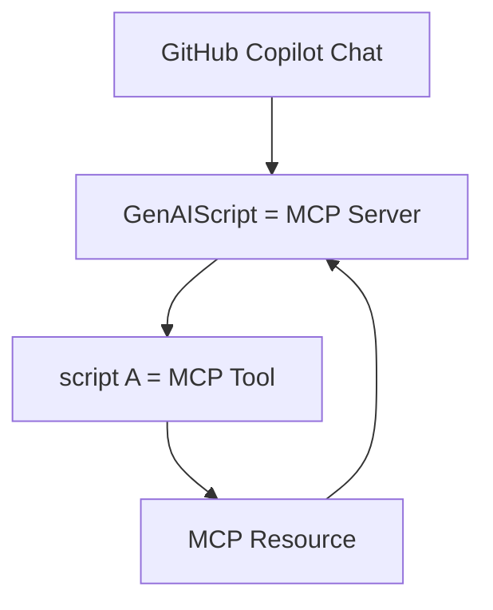

import BlogNarration from "../../../../components/BlogNarration.astro";

<BlogNarration />

# Ressources MCP

Dans un [article précédent](../../blog/scripts-as-mcp-tools/),
nous avons annoncé que chaque script peut être un [outil MCP](https://modelcontextprotocol.io/docs/concepts/tools).

Pour faire suite à cette idée, nous avons ajouté la prise en charge de la publication des [ressources MCP](https://modelcontextprotocol.io/docs/concepts/resources)
dans le cadre de l'exécution du script.

Les ressources sont une primitive essentielle du Model Context Protocol (MCP)
qui permettent aux serveurs d'exposer des données et du contenu pouvant être lus par les clients et utilisés comme contexte pour les interactions avec les LLM.



MCP gère la découverte et la résolution des ressources, donc une fois que votre script publie une ressource,
le client MCP (IDE) en est "informé" et peut décider de la lire.

## `publishResource`

La méthode `publishResource` vous permet de publier une ressource avec un identifiant unique et un fichier/chaîne/tampon.
Le reste du processus de publication de la ressource MCP est pris en charge par le framework GenAIScript.

```js
const uri = await host.publishResource("unique-id", file)
```

## Étapes suivantes

Êtes-vous prêt à créer vos propres outils et ressources MCP ?

* [Lisez la documentation](../../reference/scripts/mcp-server#resources/)

<hr />

Traduit par IA. Veuillez vérifier le contenu pour plus de précision.
