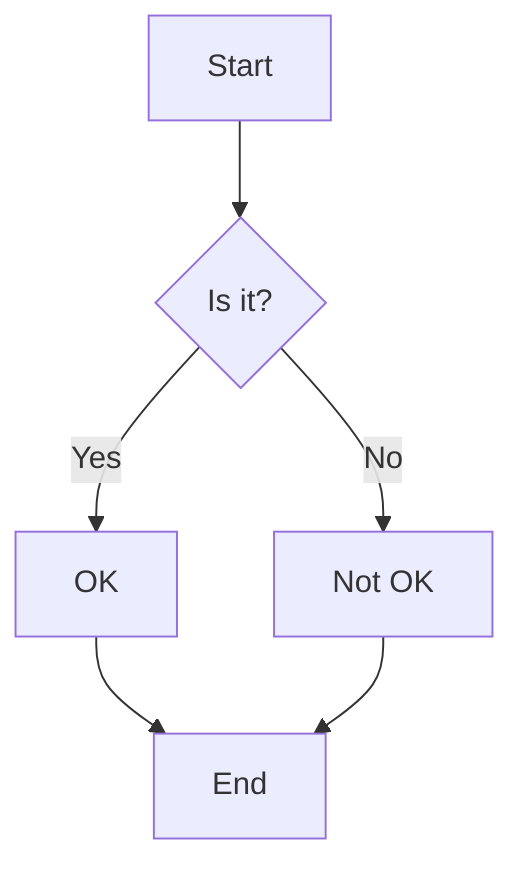
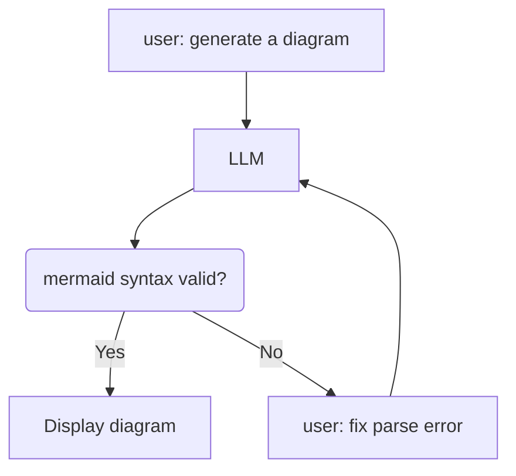
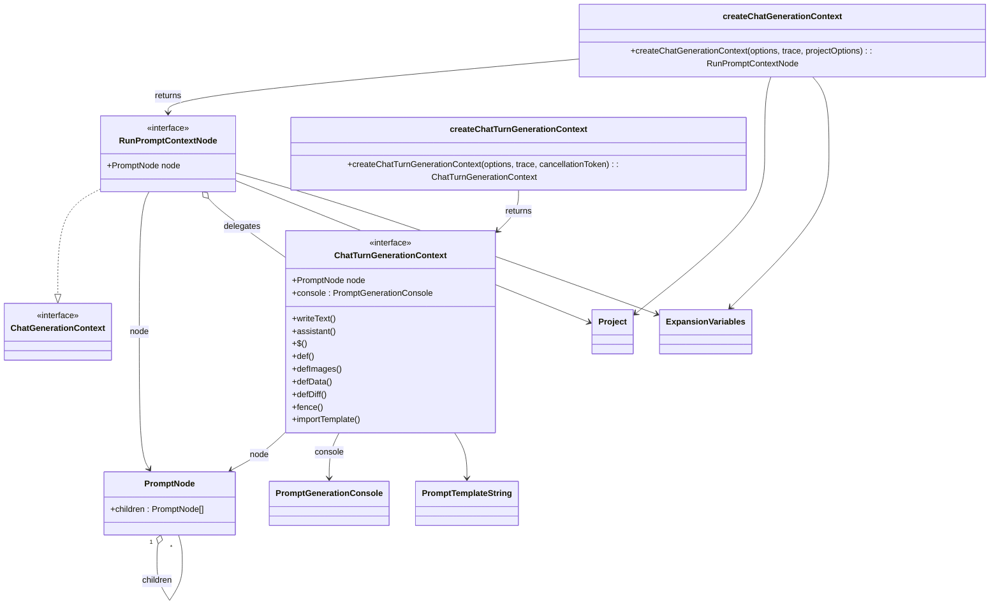

[Les diagrammes Mermaid](https://mermaid.js.org/) sont une méthode populaire pour créer des [diagrammes](/genaiscript/reference/scripts/diagrams) en markdown.
Ils sont utilisés dans de nombreux projets, [y compris dans GitHub Markdown](https://docs.github.com/en/get-started/writing-on-github/working-with-advanced-formatting/creating-diagrams).
Étant donné qu'il existe de nombreux exemples de diagrammes mermaid dans la nature,

Il n’est pas surprenant que les LLM soient assez bons pour les générer.

## Diagrammes Mermaid dans Markdown

Mermaid prend en charge plusieurs types de diagrammes ainsi que plusieurs options pour contrôler l’apparence des nœuds et des arêtes.
Vous pouvez essayer différents diagrammes dans le [aire de jeux Mermaid](https://www.mermaidchart.com/play)

Voici un exemple simple d'organigramme :

````markdown

````

Ce markdown sera rendu sous la forme d'un organigramme en mode aperçu (et sur GitHub !) :


## Erreurs de syntaxe

Un problème avec Mermaid est que... la syntaxe a de l’importance et les LLM se trompent parfois.
Introduisons une erreur de syntaxe dans l’exemple ci-dessus.

````markdown del="B ->|Yes|"
```mermaid
graph TD
    A[Start] --> B{Is it?}
    B ->|Yes| C[OK]
    B -->|No| D[Not OK]
    C --> E[End]
    D --> E
```
````

Maintenant, Mermaid ne parvient pas à analyser et le diagramme n’est pas rendu :

```text wrap
Parse error on line 3:
...--> B{Is it?}    B ->|Yes| C[OK]    B
----------------------^
Expecting 'SEMI', 'NEWLINE', 'EOF', 'AMP', 'START_LINK', 'LINK', 'LINK_ID', got 'MINUS'
```

Dans la plupart des cas, le LLM est capable de corriger l'erreur de syntaxe et de générer un diagramme valide en utilisant le message d’erreur.

## Réparation automatique

Nous avons ajouté un "réparateur" dans l’invite système [system.diagrams](/genaiscript/reference/scripts/system#systemdiagrams).
Le réparateur recherche les blocs de code `mermaid` dans la sortie et tente de les analyser.
Si le diagramme présente des erreurs d'analyse, le réparateur ajoute un message au chat pour les corriger.



Voici une trace d’un script simple qui génère un diagramme à partir de n’importe quel code.

```js wrap title="mermaid.genai.mjs"
def("CODE", env.files)
$`Generate a class diagram using mermaid of the code symbols in the CODE.`
```

Nous exécutons la [cli](/genaiscript/reference/cli) avec le script `mermaid.genai.mjs` et le fichier [runpromptcontext.ts](https://github.com/microsoft/genaiscript/tree/main/packages/core/src/runpromptcontext.ts).

```sh wrap
genaiscript run mermaid packages/core/src/runpromptcontext.ts
```

### Première tentative

Le script génère une invite avec le code et les instructions pour générer un diagramme.

````text wrap
┌─💬 github:gpt-4.1 ✉ 2 ~↑9.2kt
┌─📙 system
│## Safety: Jailbreak
│... (18 lines)
│Use clear, concise node and relationship labels.
│Implement appropriate styling and colors to enhance readability.
┌─👤 user
│<CODE lang="ts" file="packages/core/src/runpromptcontext.ts">
│import debug from "debug"
│const dbg = debug("genaiscript:prompt:context")
│// cspell: disable
│import {
│    PromptNode,
│... (1202 lines)
│        env,
│    })
│    return ctx
│}
│</CODE>
│Generate a class diagram using mermaid of the code symbols in the CODE.

```mermaid
classDiagram
    %% Main context classes and interfaces
    class ChatTurnGenerationContext {
        <<interface>>
        +node: PromptNode
...
    %% Highlights to show this is a function producing a context with many callable methods.
    class createChatGenerationContext,createChatTurnGenerationContext highlightFunction;
    classDef highlightFunction fill:#f5f,stroke:#333,stroke-width:1.5px;
```
This diagram summarizes the main types, classes, and their relationships from `runpromptcontext.ts`. The context factories (`createChatGenerationContext`, `createChatTurnGenerationContext`) produce context "objects" rich in methods. Some utilities and dependencies are shown for structure clarity.

└─🏁  github:gpt-4.1 ✉ 2 7418ms ⇅ 9.7kt ↑8.8kt ↓892t 2.47¢
````

### Erreur de syntaxe détectée, réparateur activé

Le diagramme mermaid généré contient une erreur de syntaxe.

```text wrap
Parse error on line 107:
...hatGenerationContext,createChatTurnGener
-----------------------^
Expecting 'NEWLINE', 'EOF', 'SQS', 'STR', 'DOT', 'GENERICTYPE', 'LABEL', 'STRUCT_START', 'STRUCT_STOP', 'STYLE_SEPARATOR', 'ANNOTATION_END', 'ALPHA', 'AGGREGATION', 'EXTENSION', 'COMPOSITION', 'DEPE…
```

Le réparateur entre en jeu et répond à l’assistant avec un message pour corriger l’erreur. La conversation complète du chat est renvoyée au LLM,
y compris le message d’erreur.

````text {11-20} wrap
┌─💬 github:gpt-4.1 ✉ 4 ~↑10.5kt
┌─📙 system
│...
┌─👤 user
│...
│Generate a class diagram using mermaid of the code symbols in the CODE.
┌─🤖 assistant
│```mermaid
│...
│```
┌─👤 user
│I found syntax errors in the mermaid diagram. Please repair the parse error:
│Parse error on line 107:
│...hatGenerationContext,createChatTurnGener
│-----------------------^
│Expecting 'NEWLINE', 'EOF', 'SQS', 'STR', 'DOT', 'GENERICTYPE', 'LABEL', 'STRUCT_START', 'STRUCT_STOP', 'STYLE_SEPARATOR', 'ANNOTATION_END', 'ALPHA', 'AGGREGATION', 'EXTENSION', 'COMPOSITION', 'DEPE…
````

### Le LLM répare le diagramme

Dans ce cas, le LLM parvient à réparer le diagramme et à générer un diagramme mermaid valide.

````text wrap
```mermaid
classDiagram
    %% Core Context Interfaces and Classes
    class ChatTurnGenerationContext {
        <<interface>>
...
    %% Factory highlighting (removed previous classDef/annotations for compatibility)
```
This diagram removes invalid classDef and annotation syntax and corrects relationship/arrows for Mermaid compatibility.

└─🏁  github:gpt-4.1 ✉ 4 3741ms ⇅ 10.3kt ↑9.9kt ↓457t 2.34¢
````

### Le diagramme réparé

Enfin, le diagramme réparé est renvoyé à l’utilisateur :



## Puis-je analyser moi-même les diagrammes mermaid ?

Oui, vous pouvez utiliser `parsers.mermaid` pour analyser les diagrammes mermaid dans vos scripts
de manière programmatique.

<hr />

Traduit par IA. Veuillez vérifier le contenu pour plus de précision.
