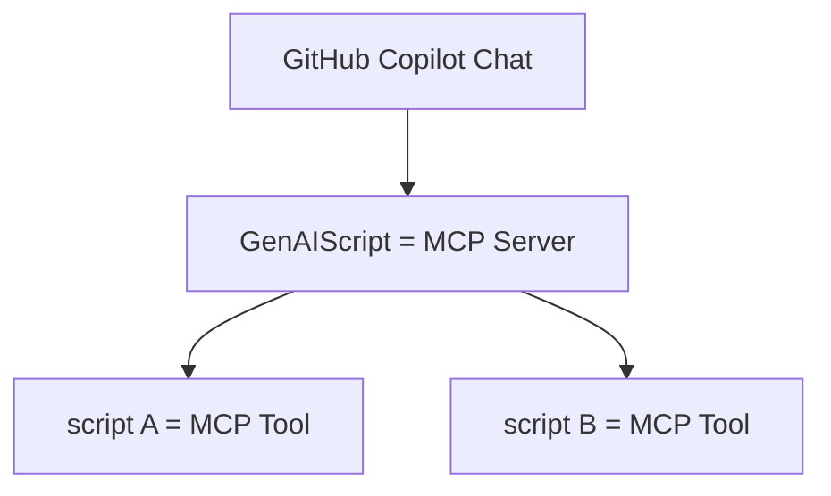

import BlogNarration from "../../../../components/BlogNarration.astro";

<BlogNarration />

🚀 Le [Protocole de contexte de modèle (MCP)](https://modelcontextprotocol.io/introduction) bouscule le monde de la technologie, et nous sommes ravis d'annoncer que GenAIScript est en première ligne de cette révolution !

Avec l'adoption rapide du MCP, des outils comme GitHub Copilot Chat intègrent déjà le support (disponible dès aujourd'hui en version Insider), et [Copilot Studio](https://www.microsoft.com/en-us/microsoft-copilot/blog/copilot-studio/introducing-model-context-protocol-mcp-in-copilot-studio-simplified-integration-with-ai-apps-and-agents/) a également annoncé leur compatibilité.

Pour suivre ces avancées passionnantes, **[GenAIScript vous permet désormais d'exposer des scripts comme des outils MCP](../../reference/scripts/mcp-server/)**. Imaginez les possibilités ! Les outils MCP fonctionnent de manière similaire aux outils LLM, où le modèle linguistique (LLM) décide du moment où les appeler, rendant votre processus de développement plus intelligent et plus efficace.

Plongez dans l'avenir du scripting avec GenAIScript et MCP. Consultez la [documentation](../../reference/scripts/mcp-server/) pour commencer.

Traduit par IA. Veuillez vérifier le contenu pour plus de précision.
