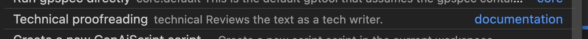

import { Tabs, TabItem } from "@astrojs/starlight/components"
import { FileTree } from "@astrojs/starlight/components"
import { Steps } from "@astrojs/starlight/components"
import { Content as CreateScript } from "../../../../components/CreateScript.mdx";
import { YouTube } from "astro-embed"

GenAIScript utilise un JavaScript stylisé avec une syntaxe minimale.
Ils sont stockés sous forme de fichiers JavaScript (`genaisrc/*.genai.mjs`) ou TypeScript (`genaisrc/*.genai.mts`) dans votre projet.
L'exécution d'un genaiscript crée l'invite qui sera envoyée au LLM.

<Steps>
  <ol>
    <li>
      <CreateScript />
    </li>

    <li>
      Le fichier résultant sera placé dans le dossier `genaisrc` de votre projet.

      <FileTree>
        * …
        * Les scripts genaisrc sont créés ici par défaut
          * genaiscript.d.ts (définitions de types TypeScript)
          * tsconfig.json (configuration du compilateur TypeScript)
          * **proofreader.genai.mts**
          * …
        * …
      </FileTree>
    </li>
  </ol>
</Steps>

:::tip
Regardez cette vidéo pour apprendre comment booster la puissance de GenAIScript dans GitHub Copilot Chat.

<YouTube id="https://youtu.be/0GkbxnW0J34" posterQuality="high" />
:::

## l'Invite

L'exécution du GenAIScript génère une invite (et plus)
qui est envoyée au modèle LLM.

La fonction de chaîne de modèle ` $``...`` ` formate et écrit la chaîne dans l'invite ;
qui est envoyée au LLM.

```js title="poem.genai.mts" system=false assistant=true
$`Write a one sentence poem.`
```

{/* genaiscript output start */}

<details>
  <summary>👤 utilisateur</summary>

  ```markdown wrap
  Write a one sentence poem.
  ```
</details>

<details open>
  <summary>🤖 assistant</summary>

  ```markdown wrap
  Roses bloom, hearts swoon, under the silver moon.
  ```
</details>

{/* genaiscript output end */}

## le Contexte

GenAIScript expose le contexte via la variable `env`. Le contexte est implicitement défini par l'emplacement où vous commencez à exécuter le script.

* vous pouvez faire un clic droit sur un dossier et `env.files` contiendra tous les fichiers imbriqués dans ce dossier.
* vous pouvez faire un clic droit sur ou dans un fichier et `env.files` contiendra uniquement ce fichier.
* vous pouvez exécuter le script en utilisant l’[interface en ligne de commande](../../reference/cli/) et spécifier le contenu de `env.files` dans les arguments CLI.

```js title="proofreader.genai.mts" system=false assistant=false user=true
def("FILES", env.files)
```

{/* genaiscript output start */}

<details open>
  <summary>👤 utilisateur</summary>

  ````markdown wrap
  FILES:

  ```md file="src/samples/markdown.md"
  ---
  title: What is Markdown? - Understanding Markdown Syntax
  description: Learn about Markdown, a lightweight markup language for formatting plain text, its syntax, and how it differs from WYSIWYG editors.
  keywords: Markdown, markup language, formatting, plain text, syntax
  sidebar: mydoc_sidebar
  ---

  What is Markdown?
  Markdown is a lightweight markup language that you can use to add formatting elements to plaintext text documents. Created by John Gruber in 2004, Markdown is now one of the world’s most popular markup languages.

  Using Markdown is different than using a WYSIWYG editor. In an application like Microsoft Word, you click buttons to format words and phrases, and the changes are visible immediately. Markdown isn’t like that. When you create a Markdown-formatted file, you add Markdown syntax to the text to indicate which words and phrases should look different.

  For example, to denote a heading, you add a number sign before it (e.g., # Heading One). Or to make a phrase bold, you add two asterisks before and after it (e.g., **this text is bold**). It may take a while to get used to seeing Markdown syntax in your text, especially if you’re accustomed to WYSIWYG applications. The screenshot below shows a Markdown file displayed in the Visual Studio Code text editor....
  ```
  ````
</details>

{/* genaiscript output end */}

## la Tâche

La fonction `$` est utilisée pour construire le texte de l’invite, elle rend et écrit le texte dans l’invite
(`$` est un [template literal](https://developer.mozilla.org/en-US/docs/Web/JavaScript/Reference/Template_literals)).

```js title="proofreader.genai.mts"
def("FILES", env.files)
$`You are an expert technical writer and proofreader.
Review the documents in FILE and report the 2 most important issues.`
```

{/* genaiscript output start */}

<details>
  <summary>👤 utilisateur</summary>

  ````markdown wrap
  FILES:

  ```md file="src/samples/markdown.md"
  ---
  title: What is Markdown? - Understanding Markdown Syntax
  description: Learn about Markdown, a lightweight markup language for formatting plain text, its syntax, and how it differs from WYSIWYG editors.
  keywords: Markdown, markup language, formatting, plain text, syntax
  sidebar: mydoc_sidebar
  ---

  What is Markdown?
  Markdown is a lightweight markup language that you can use to add formatting elements to plaintext text documents. Created by John Gruber in 2004, Markdown is now one of the world’s most popular markup languages.

  Using Markdown is different than using a WYSIWYG editor. In an application like Microsoft Word, you click buttons to format words and phrases, and the changes are visible immediately. Markdown isn’t like that. When you create a Markdown-formatted file, you add Markdown syntax to the text to indicate which words and phrases should look different.

  For example, to denote a heading, you add a number sign before it (e.g., # Heading One). Or to make a phrase bold, you add two asterisks before and after it (e.g., **this text is bold**). It may take a while to get used to seeing Markdown syntax in your text, especially if you’re accustomed to WYSIWYG applications. The screenshot below shows a Markdown file displayed in the Visual Studio Code text editor....
  ```

  You are an expert technical writer and proofreader.
  Review the documents in FILE and report the 2 most important issues.
  ````
</details>

<details open>
  <summary>🤖 assistant</summary>

  ```markdown wrap
  I reviewed the document in "src/samples/markdown.md" and found the following two important issues:

  1. **Missing Consistency in Heading Styles**: The document lacks consistency in heading styles, which can make the structure of the content unclear. For instance, it should use either the "atx-style" (with # symbols for headings) or the "setext-style" (with underlining for headings) consistently throughout the document to maintain a clear visual hierarchy.

  2. **Lack of Examples**: The document describes Markdown syntax but lacks concrete examples to illustrate how to use Markdown for formatting. Including examples would enhance the reader's understanding of the syntax and its practical application.

  These are the two most important issues that need to be addressed in the document.
  ```
</details>

{/* genaiscript output end */}

## les Métadonnées

Vous pouvez ajouter un appel à la fonction `script` pour fournir des métadonnées sur le script
et le modèle. Les métadonnées sont utilisées pour afficher le script dans l’interface utilisateur et configurer le modèle LLM.

```js title="proofreader.genai.mts"
// the metadata
script({
    // user interface
    title: "Technical proofreading",
    description: "Reviews the text as a tech writer.",
    group: "documentation",
    // model configuration
    model: "large",
    temperature: 0,
})
def("FILES", env.files)
$`You are an expert technical writer and proofreader.
Review the documents in FILE and report the 2 most important issues.`
```

{/* genaiscript output start */}

<details>
  <summary>👤 utilisateur</summary>

  ````markdown wrap
  FILES:

  ```md file="src/samples/markdown.md"
  ---
  title: What is Markdown? - Understanding Markdown Syntax
  description: Learn about Markdown, a lightweight markup language for formatting plain text, its syntax, and how it differs from WYSIWYG editors.
  keywords: Markdown, markup language, formatting, plain text, syntax
  sidebar: mydoc_sidebar
  ---

  What is Markdown?
  Markdown is a lightweight markup language that you can use to add formatting elements to plaintext text documents. Created by John Gruber in 2004, Markdown is now one of the world’s most popular markup languages.

  Using Markdown is different than using a WYSIWYG editor. In an application like Microsoft Word, you click buttons to format words and phrases, and the changes are visible immediately. Markdown isn’t like that. When you create a Markdown-formatted file, you add Markdown syntax to the text to indicate which words and phrases should look different.

  For example, to denote a heading, you add a number sign before it (e.g., # Heading One). Or to make a phrase bold, you add two asterisks before and after it (e.g., **this text is bold**). It may take a while to get used to seeing Markdown syntax in your text, especially if you’re accustomed to WYSIWYG applications. The screenshot below shows a Markdown file displayed in the Visual Studio Code text editor....
  ```

  You are an expert technical writer and proofreader.
  Review the documents in FILE and report the 2 most important issues.
  ````
</details>

<details open>
  <summary>🤖 assistant</summary>

  ```markdown wrap
  File src/samples/markdown.md:

  1. **Missing Consistency in Heading Styles**: The document lacks consistency in heading styles. For instance, it uses both "What is Markdown?" and "What is Markdown" as headings. Consistency in heading styles is crucial for a professional and polished document.

  2. **Lack of Visual Examples**: While the document explains Markdown syntax, it would benefit from visual examples to illustrate the formatting. Visual examples can enhance understanding, especially for readers who are new to Markdown.

  These are the two most important issues in the document.
  ```
</details>

{/* genaiscript output end */}

Les propriétés `title`, `description` et `group` sont utilisées pour afficher le script dans l’interface utilisateur
et peuvent être utiles lorsque l’utilisateur recherche un script.



## Étapes suivantes

* Suivez le [guide Prompt As Code](../../guides/prompt-as-code/) pour approfondir la génération programmatique d’invites
* [Exécutez votre script](../../getting-started/running-scripts/) depuis Visual Studio Code.

<hr />

Traduit par IA. Veuillez vérifier le contenu pour plus de précision.
