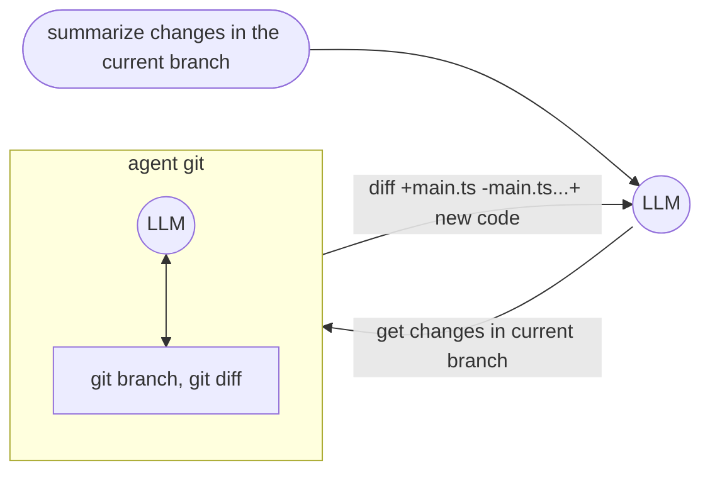
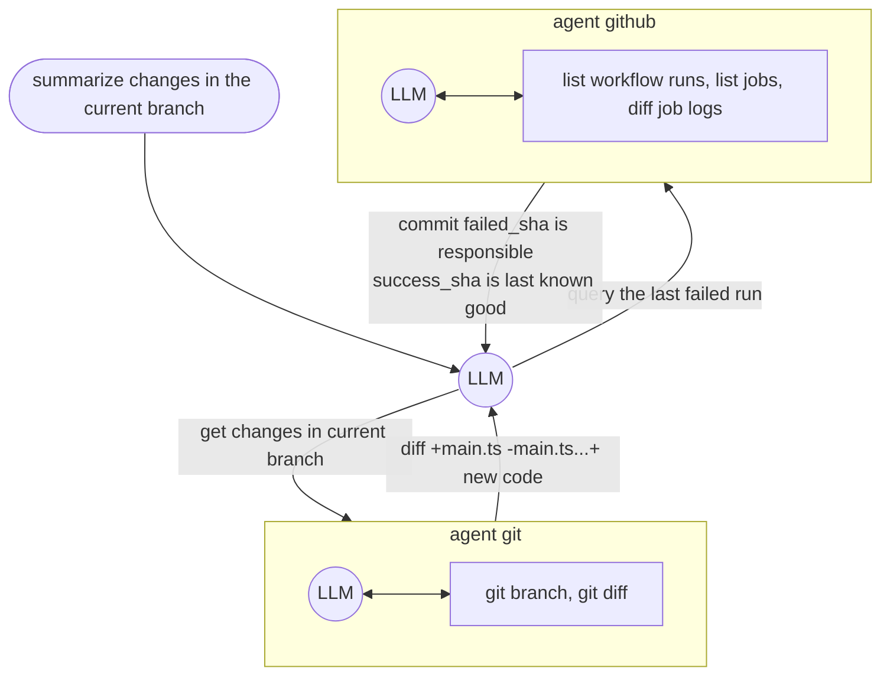
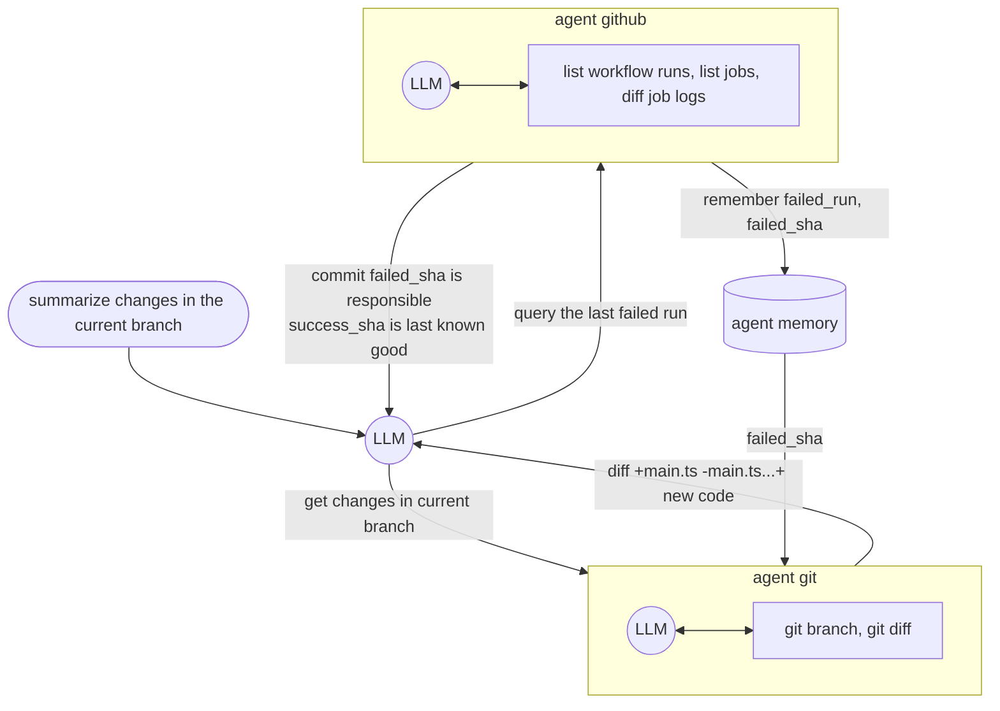

import { Code } from "@astrojs/starlight/components"
import { Content as BuiltinAgents } from "../../../../../components/BuiltinAgents.mdx";
import sourceMulti from "../../../../../../../samples/sample/genaisrc/agent_git_other.genai.mjs?raw";

GenAIScript définit un **agent** comme un [outil](../../../reference/reference/scripts/tools/) qui exécute un [prompt inline](../../../reference/reference/scripts/inline-prompts/) pour accomplir une tâche. Le LLM de l'agent est généralement augmenté avec des outils supplémentaires et une mémoire.

```js
script({
    // use all agents
    tools: "agent",
})

// agent git to get the commits
// agent interpreter to run python code
$`Do a statistical analysis of the last commits`
```

**GenAIScript ne met *pas* en œuvre de flux de travail ni de décision agentique.**
Il repose entièrement sur le support des [outils](../../../reference/reference/scripts/tools/) intégré dans les LLMs.

## Agent = LLM + Outils

Prenons l'exemple de `agent_git` qui interroge un dépôt git. Cet agent est enregistré comme un `outil` et peut être utilisé dans le prompt du LLM.
Lorsque le LLM a besoin d'informations comme "résumer les changements dans la branche actuelle", il appelle l'outil `agent_git` avec la requête `get changes in the current branch`.

L'outil `agent_git` a lui-même accès à divers outils spécialisés pour git comme `git branch`, `git diff` qu'il peut utiliser pour résoudre le problème.
Il devra identifier les branches actuelle et par défaut, calculer un diff et le retourner au LLM principal.



## Agent vs Outils

Un "agent" est un outil qui interroge un LLM, équipé d'autres outils, pour accomplir des tâches. C'est une abstraction de plus haut niveau qui peut être utilisée pour regrouper plusieurs outils.
Dans certains scénarios, vous pourriez décider de supprimer cette abstraction et de passer directement les outils au LLM appelant.
Dans cet exemple simple, vous pourriez également décider d'aplatir cet arbre et de donner accès aux outils git au LLM principal sans utiliser d'agent.


Cependant, l'abstraction de l'agent devient utile lorsque vous commencez à avoir trop de fonctions ou pour maintenir la longueur d'une conversation chat courte, car chaque appel LLM de l'agent est "compressé" à la réponse de l'agent.

## Agents multiples

Prenons un exemple plus complexe où plusieurs agents interviennent dans la conversation. Dans ce cas, nous souhaitons examiner pourquoi une action GitHub a échoué.
Cela implique les agents `agent_git` et `agent_github`. L'agent `agent_github` peut interroger les workflows, exécutions, travaux et journaux, tandis que `agent_git` peut interroger le dépôt git.



## Mémoire

Tous les agents sont équipés d'une **mémoire** qui leur permet de partager des informations horizontalement entre toutes les conversations.

La mémoire est un journal qui stocke toutes les interactions `agent / requête / réponse`. Lors de la génération d'un prompt pour un agent, la mémoire est d'abord interrogée (à l'aide d'un petit LLM) pour extraire des informations pertinentes, et ces informations sont transmises à l'agent dans la requête.

```txt
ask agent about "query":
    wisdom = find info in memory about "query"
    agent answer "query" using your tools and information in "wisdom"
```



Tous les agents contribuent à la mémoire de la conversation, sauf si cela est explicitement désactivé avec `disableMemory`.

```js "disableMemory: true"
defAgent(..., { disableMemory: true })
```

## defAgent

La fonction `defAgent` est utilisée pour définir un agent qui peut être appelé par le LLM. Elle prend un schéma JSON pour définir les entrées et attend une sortie sous forme de chaîne. Le LLM décide de façon autonome d'appeler cet agent.

```ts
defAgent(
    "git", // agent id becomes 'agent_git'
    "Handles any git operation", // description
    "You are a helpful expert in using git.",
    {
        tools: ["git"],
    }
)
```

* l'id de l'agent deviendra l'id de l'outil `agent_<id>`
* la description de l'agent sera automatiquement augmentée avec des informations sur les outils disponibles

## Plusieurs instances du même agent

Certains agents, comme `agent_git`, peuvent être instanciés avec des configurations différentes, comme travailler sur des dépôts différents.

<Code code={sourceMulti} wrap={true} lang="js" title="multi-agents.genai.mts" />

<BuiltinAgents />

## Exemple `agent_github`

Illustrons cela en construisant un agent GitHub. L'agent est un outil qui reçoit une requête et exécute un prompt LLM avec des outils liés à GitHub.

La définition de l'agent ressemble à ceci :

```js wrap
defAgent(
    "github", // id
    "query GitHub to accomplish tasks", // description
    // callback to inject content in the LLM agent prompt
    (ctx) =>
        ctx.$`You are a helpful LLM agent that can query GitHub to accomplish tasks.`,
    {
        // list tools that the agent can use
        tools: ["github_actions"],
    }
)
```

et en interne, elle est étendue de la manière suivante :

```js wrap
defTool(
    // agent_ is always prefixed to the agent id
    "agent_github",
    // the description is augmented with the tool descriptions
    `Agent that can query GitHub to accomplish tasks

    Capabilities:
    - list github workflows
    - list github workflows runs
    ...`,
    // all agents have a single "query" parameter
    {
        query: {
            type: "string",
            description: "Query to answer",
        },
        required: ["query"]
    },
    async(args) => {
        const { query } = args
        ...
    })
```

Dans le callback, nous utilisons `runPrompt` pour exécuter une requête LLM.

* le prompt prend l'argument de requête et indique au LLM comment le gérer.
* notez l'utilisation de `ctx.` pour les prompts imbriqués

```js wrap
        const res = await runPrompt(
            (ctx) => {
                // callback to inject content in the LLM agent prompt
                ctx.$`You are a helpful LLM agent that can query GitHub to accomplish tasks.`

                ctx.def("QUERY", query)
                _.$`Analyze and answer QUERY.
                - Assume that your answer will be analyzed by an LLM, not a human.
                - If you cannot answer the query, return an empty string.
                `
            }, , {
                system: [...],
                // list of tools that the agent can use
                tools: ["github_actions", ...]
            }
        )
        return res
```

## Sélection des outils et prompts système

Nous utilisons le paramètre `system` pour configurer les outils exposés au LLM. Dans ce cas, nous exposons les outils GitHub (`system.github_files`, `system.github_issues`, …).

```js wrap
            {
                system: [
                    "system",
                    "system.tools",
                    "system.explanations",
                    "system.github_actions",
                    "system.github_files",
                    "system.github_issues",
                    "system.github_pulls",
                ],
            }
```

La source complète de cet agent est définie dans le prompt système [system.agent\_github](../../../reference/reference/scripts/system/#systemagent_github/).

## Journalisation

Chaque agent utilise un espace de noms de [journalisation](../../../reference/reference/scripts/logging/) `agent:<nom>` pour signaler les informations de débogage.

Pour obtenir les journaux depuis le cli, vous pouvez utiliser la variable d'environnement `DEBUG` pour activer les journaux pour un agent spécifique.

```sh
DEBUG=agent:github* genaiscript run ...
```
