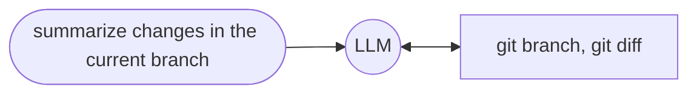

import { Code } from "@astrojs/starlight/components"
import { Content as BuiltinAgents } from "../../../../../components/BuiltinAgents.mdx";
import sourceMulti from "../../../../../../../packages/sample/genaisrc/agent_git_other.genai.mjs?raw";

GenAIScript définit un **agent** comme un [outil](/genaiscript/reference/scripts/tools) qui exécute un [prompt en ligne](/genaiscript/reference/scripts/inline-prompts) pour accomplir une tâche. Le LLM de l'agent est généralement enrichi avec des outils supplémentaires et une mémoire.

```js
script({
    // use all agents
    tools: "agent",
})

// agent git to get the commits
// agent interpreter to run python code
$`Do a statistical analysis of the last commits`
```

**GenAIScript n'implémente *pas* de flux de travail agentique ni de décision.**\
Il s'appuie entièrement sur le support des [outils](/genaiscript/reference/scripts/tools) intégrés aux LLM.

## Agent = LLM + Outils

Regardons l'exemple `agent_git` qui interroge un dépôt git. Cet agent est enregistré en tant que `outil` et peut être utilisé dans le prompt du LLM.\
Quand le LLM a besoin d'informations sur quelque chose comme "résumer les modifications dans la branche actuelle", il appellera l'outil `agent_git` avec la requête `obtenir les modifications dans la branche actuelle`.

L'outil `agent_git` lui-même a accès à divers outils dédiés à git comme `git branch`, `git diff` qu'il peut utiliser pour résoudre la requête.\
Il devra déterminer la branche actuelle et par défaut, calculer une différence (diff) et la renvoyer au LLM principal.


## Agent vs Outils

Un "agent" est un outil qui interroge un LLM, équipé d'autres outils, pour accomplir des tâches. C'est une abstraction de haut niveau qui peut être utilisée pour regrouper plusieurs outils ensemble.\
Dans certains scénarios, vous pouvez décider de supprimer cette abstraction et de passer outre l'agent en "donnant" les outils au LLM appelant.\
Dans cet exemple simple, vous pourriez également décider d'aplatir cet arbre et donner accès aux outils git au LLM principal et ignorer l'agent.



Cependant, l'abstraction agent devient utile lorsque vous commencez à avoir trop de fonctions ou pour garder la longueur de la conversation courte car chaque appel agent LLM est "compressé" en la réponse de l'agent.

## Agents multiples

Examinons un exemple plus complexe où plusieurs agents sont impliqués dans la conversation. Ici, nous voulons enquêter sur la raison d'un échec d'une action GitHub.\
Cela implique les agents `agent_git` et `agent_github`. L'agent `agent_github` peut interroger les workflows, exécutions, jobs, logs et l'agent `agent_git` peut interroger le dépôt git.


## Mémoire

Tous les agents sont équipés d'une **mémoire** qui leur permet de partager des informations horizontalement à travers toutes les conversations.

La mémoire est un journal qui stocke toutes les interactions `agent / requête / réponse`. Lors de la génération du prompt pour un agent, la mémoire est d'abord sollicitée (en utilisant un petit LLM) pour extraire les informations pertinentes,\
et ces informations sont ensuite transmises à la requête de l'agent.

```txt
ask agent about "query":
    wisdom = find info in memory about "query"
    agent answer "query" using your tools and information in "wisdom"
```


Tous les agents contribuent à la mémoire de la conversation sauf si cette fonction est explicitement désactivée via `disableMemory`.

```js "disableMemory: true"
defAgent(..., { disableMemory: true })
```

## defAgent

La fonction `defAgent` est utilisée pour définir un agent pouvant être appelé par le LLM. Elle prend un schéma JSON pour définir l'entrée et attend une sortie de type chaîne de caractères. Le LLM décide de manière autonome d'appeler cet agent.

```ts
defAgent(
    "git", // agent id becomes 'agent_git'
    "Handles any git operation", // description
    "You are a helpful expert in using git.",
    {
        tools: ["git"],
    }
)
```

* * l'identifiant de l'agent deviendra l'identifiant de l'outil `agent_<id>`
* * la description de l'agent sera automatiquement augmentée avec des informations sur les outils disponibles

## Instances multiples du même agent

Certains agents, comme `agent_git`, peuvent être instanciés avec différentes configurations, par exemple pour travailler sur différents dépôts.

<Code code={sourceMulti} wrap={true} lang="js" title="multi-agents.genai.mts" />

<BuiltinAgents />

## Exemple `agent_github`

Illustrons cela en construisant un agent GitHub. L'agent est un outil qui reçoit une requête et exécute un prompt LLM avec des outils liés à GitHub.

La définition de l'agent ressemble à ceci :

```js wrap
defAgent(
    "github", // id
    "query GitHub to accomplish tasks", // description
    // callback to inject content in the LLM agent prompt
    (ctx) =>
        ctx.$`You are a helpful LLM agent that can query GitHub to accomplish tasks.`,
    {
        // list tools that the agent can use
        tools: ["github_actions"],
    }
)
```

et en interne, elle est développée en ce qui suit :

```js wrap
defTool(
    // agent_ is always prefixed to the agent id
    "agent_github",
    // the description is augmented with the tool descriptions
    `Agent that can query GitHub to accomplish tasks

    Capabilities:
    - list github workflows
    - list github workflows runs
    ...`,
    // all agents have a single "query" parameter
    {
        query: {
            type: "string",
            description: "Query to answer",
        },
        required: ["query"]
    },
    async(args) => {
        const { query } = args
        ...
    })
```

À l'intérieur du callback, nous utilisons `runPrompt` pour exécuter une requête LLM.

* * le prompt prend l'argument de la requête et indique au LLM comment la gérer.
* * notez l'utilisation de `ctx.` pour les prompts imbriqués

```js wrap
        const res = await runPrompt(
            (ctx) => {
                // callback to inject content in the LLM agent prompt
                ctx.$`You are a helpful LLM agent that can query GitHub to accomplish tasks.`

                ctx.def("QUERY", query)
                _.$`Analyze and answer QUERY.
                - Assume that your answer will be analyzed by an LLM, not a human.
                - If you cannot answer the query, return an empty string.
                `
            }, , {
                system: [...],
                // list of tools that the agent can use
                tools: ["github_actions", ...]
            }
        )
        return res
```

## Sélection des Outils et des Prompts Système

Nous utilisons le paramètre `system` pour configurer les outils exposés au LLM. Dans ce cas, nous exposons les outils GitHub (`system.github_files`, `system.github_issues`, ...)

```js wrap
            {
                system: [
                    "system",
                    "system.tools",
                    "system.explanations",
                    "system.github_actions",
                    "system.github_files",
                    "system.github_issues",
                    "system.github_pulls",
                ],
            }
```

Le code complet de cet agent est défini dans le prompt système [system.agent\_github](/genaiscript/reference/scripts/system/#systemagent_github).

## Journalisation

Chaque agent utilise un namespace de [journalisation](/genaiscript/reference/scripts/logging) `agent:<nom>`\
pour rapporter des informations de débogage.

Pour activer la journalisation depuis la ligne de commande, vous pouvez utiliser la variable d'environnement `DEBUG` pour cibler un agent spécifique.

```sh
DEBUG=agent:github* genaiscript run ...
```

<hr />

Traduit avec l'aide de l'IA. Veuillez vérifier l'exactitude du contenu.
