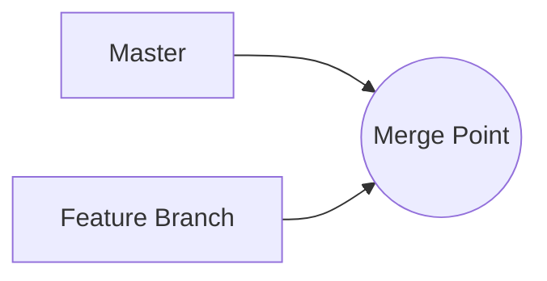
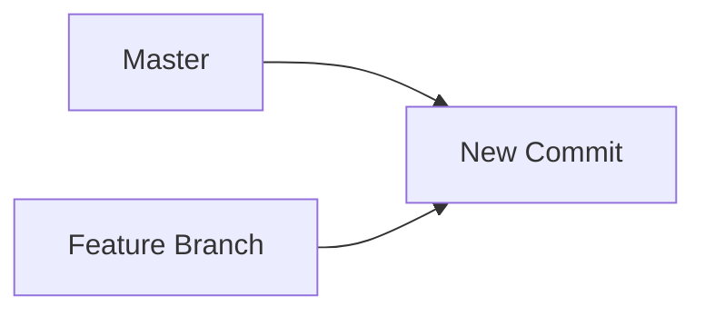

Il est souvent utile de demander à un LLM de générer un diagramme. Heureusement, de nombreux LLMs connaissent déjà [mermaid](https://mermaid.js.org/), une extension populaire de Markdown pour créer des diagrammes et des graphiques.



## Réparation automatique de la syntaxe Mermaid

L’invite système `system.diagrams` enregistre un participant au chat de réparation qui tentera de corriger toute erreur de syntaxe dans les diagrammes Mermaid générés. Il n’est pas rare que les LLMs produisent une syntaxe Mermaid invalide, donc cette fonctionnalité est utile.

## Parseur

Vous pouvez invoquer directement le parseur mermaid depuis GenAIScript à l'aide de la fonction `parsers.mermaid`.

Vous pouvez utiliser la valeur `result.error` pour vérifier si l'analyse a réussi. Si ce n'est pas le cas, vous pouvez utiliser la valeur `result.error` pour réparer le diagramme avec un LLM.

## Prise en charge de l’aperçu Markdown

* Installez l’extension [Markdown Preview Mermaid Support](https://marketplace.visualstudio.com/items?itemName=bierner.markdown-mermaid) pour VS Code.

* Mentionnez `diagram` dans le programme ou ajoutez `system.diagram` à la liste des invites système.

```js
$`Generate a diagram of a merge.`
```

<details>
  <summary>👤 utilisateur</summary>

  ```markdown wrap
  Generate a diagram of a merge.
  ```
</details>

<details open>
  <summary>🤖 assistant </summary>

  ````markdown wrap
  ```mermaid
  graph LR
      A[Master] --> B((Merge Point))
      C[Feature Branch] --> B
  ```
  ````
</details>

Le Markdown généré apparaîtra comme suit :

````markdown

````

et il est rendu automatiquement une fois l’extension installée.

