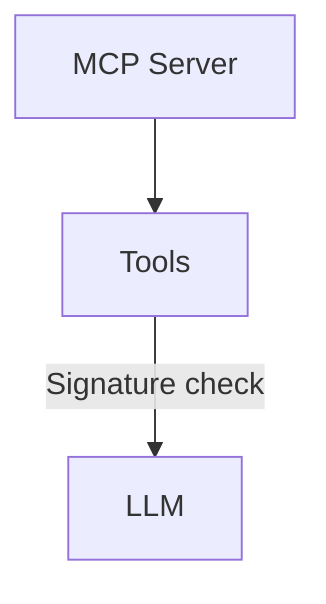
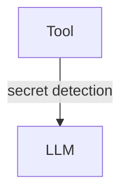
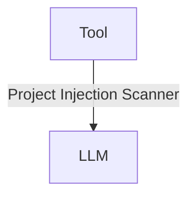
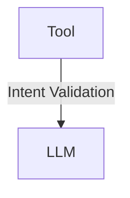

import { Image } from "astro:assets"
import { YouTube } from "astro-embed"
import logoPng from "../../../../../assets/mcp.png";
import logoPngTxt from "../../../../../assets/mcp.png.txt?raw";

<Image src={logoPng} alt={logoPngTxt} />

Le [Model Context Protocol](https://modelcontextprotocol.io/) (MCP) définit un protocole permettant de partager des [outils](https://modelcontextprotocol.io/docs/concepts/tools) et de les utiliser quel que soit le framework ou l'environnement d'exécution sous-jacent.

**GenAIScript implémente un client pour les serveurs/outils MCP**.

<YouTube id="https://youtu.be/q4Um2Mlvxy8" posterQuality="high" />

:::tip
GenAIScript implémente également un serveur pour MCP, qui expose tout script comme un outil. Consultez [Serveur MCP](../../../reference/reference/scripts/mcp-server/) pour plus de détails.
:::

## Configuration des serveurs

Vous pouvez déclarer la configuration du serveur MCP dans la fonction `script` (en tant qu'outils ou agents) ou les charger dynamiquement à l'aide de `defTool`.

### `mcpServers`

Vous pouvez déclarer la configuration du serveur MCP dans le champ `mcpServers` de `script` ou `runPrompt`. Cela correspond à la même configuration que le fichier de configuration de Claude.

```js "mcpServers:"
script({
    mcpServers: {
        memory: {
            command: "npx",
            args: ["-y", "@modelcontextprotocol/server-memory"],
        },
        filesystem: {
            command: "npx",
            args: [
                "-y",
                "@modelcontextprotocol/server-filesystem",
                path.resolve("."),
            ],
        },
    },
})
```

Si vous recherchez un sous-ensemble d'outils, vous pouvez fournir une liste d'identifiants d'outils.

```json '"tools": ["tool1", "tool2"]'
    mcpServers {
        "...": {
            "...": "...",
            "tools": ["tool1", "tool2"]
        }
    }
```

:::tip
Consultez la section [Sécurité](#security) pour les options permettant de sécuriser l'utilisation des serveurs MCP.
:::

### `mcpAgentServers`

Le `mcpAgentServers` déclare un ensemble de serveurs MCP qui seront encapsulés dans des agents distincts et injectés dans la liste des outils. C'est une manière efficace de charger et d'organiser les serveurs MCP comme agents dédiés à des tâches spécifiques.

Cela utilise la même configuration avec un paramètre supplémentaire `description` et un paramètre optionnel `instructions`. La description est injectée dans la description de l'agent et les instructions sont injectées dans l'agent prompt.

```js
script({
    mcpAgentServers: {
        memory: {
            description: "A memory server",
            instructions: "Use this server to store and retrieve data.",
            command: "npx",
            args: ["-y", "@modelcontextprotocol/server-memory"],
        },
        filesystem: {
            description: "A filesystem server",
            instructions: "Use this server to read and write files.",
            command: "npx",
            args: [
                "-y",
                "@modelcontextprotocol/server-filesystem",
                path.resolve("."),
            ],
        },
    },
})
```

### Variables d’environnement

Définir le champ `env` dans la configuration `mcpServers` ou `mcpAgentServers` vous permet de passer des variables d'environnement au serveur MCP. Laissez la valeur vide et GenAIScript injectera automatiquement les variables d'environnement du processus en cours.

```js 'MY_ENV_VAR: ""'
script({
    mcpServers: {
        memory: {
            command: "npx",
            args: ["-y", "@modelcontextprotocol/server-memory"],
            env: {
                MY_ENV_VAR: "",
            },
        },
    },
})
```

### `defTool`

Vous pouvez utiliser [defTool](../../../reference/reference/scripts/tools/) pour déclarer un ensemble de configurations de serveurs, en utilisant la même syntaxe que dans le [fichier de configuration Claude](https://github.com/modelcontextprotocol/servers?tab=readme-ov-file#using-an-mcp-client).

```js
defTool({
    memory: {
        command: "npx",
        args: ["-y", "@modelcontextprotocol/server-memory"],
    },
    filesystem: {
        command: "npx",
        args: [
            "-y",
            "@modelcontextprotocol/server-filesystem",
            path.resolve("."),
        ],
    },
})
```

GenAIScript lancera le serveur et enregistrera tous les outils répertoriés par le serveur. L'identifiant de l'outil sera `server_tool_name` pour éviter les conflits.

:::tip
Si votre outil a un nom qui n'est pas un identifiant valide, vous pouvez utiliser la syntaxe `["tool-name"]`.

```js '["server-memory"]
defTool({
    ["server-memory"]: {
        ...
    },
})
```
:::

## Cycle de vie des serveurs

Les serveurs se lancent lors du rendu du prompt et s'arrêtent une fois la session de chat terminée.

Cela signifie que si vous définissez des serveurs dans un [prompt en ligne](../../../reference/reference/scripts/inline-prompts/), le serveur sera démarré/arrêté pour chaque prompt en ligne.

## Trouver des serveurs

La liste des serveurs disponibles peut être trouvée dans le projet [Model Context Protocol Servers](https://github.com/modelcontextprotocol/servers).

## Sécurité <a id="security" href="" />

Le [Model Context Protocol](https://modelcontextprotocol.io/) est un protocole puissant qui comporte également un certain nombre de risques de sécurité dont il faut être conscient. GenAIScript implémente divers mécanismes de protection pour atténuer ces risques. Cependant, il est important de comprendre les risques et comment les utiliser.

### Packages Dockerisés

De nombreux packages sont disponibles sous forme d'images Docker. C'est un bon moyen d'exécuter un package dans un environnement isolé. Cela résout également les problèmes de configuration/de l'installation d'outils.

### Fixation des versions des packages

Vous pouvez fixer la version du serveur MCP exécuté avec `npx` ou d'autres gestionnaires de packages. Cela permet de garantir que le serveur ne sera pas mis à jour vers une nouvelle version pouvant casser votre script ou introduire une vulnérabilité.

```js '@0.6.2'
script({
    mcpServers: {
        memory: {
            command: "npx",
            args: ["-y", "@modelcontextprotocol/server-memory@0.6.2"],
        },
    },
})
```

### Validation de la signature des outils

GenAIScript prend en charge la définition de la `signature` des outils déclarés par un serveur. Si la signature des outils ne correspond pas, GenAIScript refusera de charger le serveur (et générera une erreur).



Cela empêche les **attaques de type rug pull**, où un serveur MCP changerait les outils en fonction de certaines conditions externes (par exemple, lors d'une deuxième exécution).

Pour activer cette fonctionnalité, commencez par définir `toolsSha` avec une valeur vide pour déclencher la validation.

```js 'toolsSha: ""'
script({
    mcpServers: {
        playwright: {
            ...,
            toolsSha: ""
        }
    }
})
```

Ensuite, exécutez votre script, et le chargement du serveur MCP échouera. Le journal du terminal contiendra la signature calculée des outils et un fichier mis en cache contenant le contenu des outils afin que vous puissiez l'examiner de plus près. Si tout semble correct, vous pouvez régler la signature sur `toolsSha` et relancer le script.

```js 'toolsSha: ""'
script({
    mcpServers: {
        playwright: {
            ...,
            toolsSha: "52cf857f903...72ab44a5"
        }
    }
})
```

### Détection de secrets dans les sorties d'outils

Un outil peut accidentellement lire un secret provenant de l'environnement ou de l'entrée. Par exemple, un outil qui récupère une URL peut renvoyer une page contenant un secret.



Pour empêcher cela, utilisez le [scanner de secrets](../../../reference/reference/scripts/secret-scanning/) sur toutes les sorties d'outils.

### Injection de Prompt dans les sorties d'outils

Un outil peut renvoyer des données contenant des attaques d'injection de prompts. Par exemple, un outil qui récupère une URL peut renvoyer une page contenant des attaques d'injection de prompts.



Pour éviter cela, vous pouvez activer l'option `detectPromptInjection`. Cela exécutera vos services [d'analyse de sécurité de contenu](../../../reference/reference/scripts/content-safety/)
sur la sortie de l'outil et effacera la réponse si une attaque est détectée.

```js 'detectPromptInjection: "always"'
script({
    mcpServers: {
        playwright: {
            ...,
            detectPromptInjection: "always"
        }
    }
})
```

## Validation de l'intention des résultats d'outils

Vous pouvez configurer GenAIScript pour exécuter une validation LLM-as-a-Judge du résultat de l'outil en fonction de la description ou d'une intention personnalisée.
La validation LLM-as-a-Judge se produira sur chaque réponse de l'outil en utilisant l'alias de modèle `intent`, qui est mappé à `small` par défaut.



L'intention `description` est une valeur spéciale qui est développée à la description de l'outil.

```js
mcpServers: {
    playwright: {
        command: "npx",
        args: ["--yes", "@playwright/mcp@latest", "--headless"],
        intent: "description",
    },
},
```