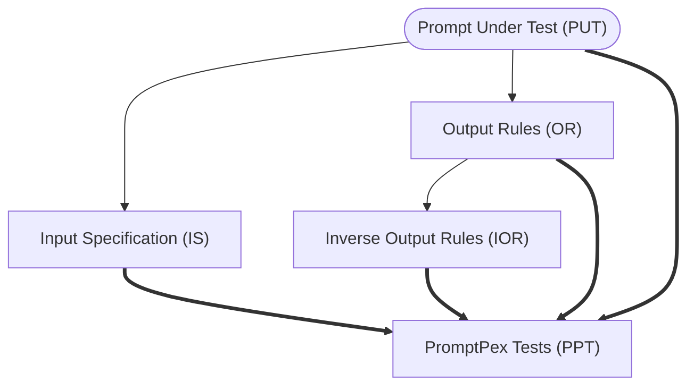

# PromptPex

## Automated Test and Eval generation from Prompts

```mermaid
graph TD
    PUT(["Prompt Under Test (PUT)"])
    IS["Input Specification (IS)"]
    OR["Output Rules (OR)"]
    IOR["Inverse Output Rules (IOR)"]
    PPT["PromptPex Tests (PPT)"]

    PUT --> IS
    PUT --> OR
    OR --> IOR
    IS ==> PPT
    OR ==> PPT
    PUT ==> PPT
    IOR ==> PPT
```
